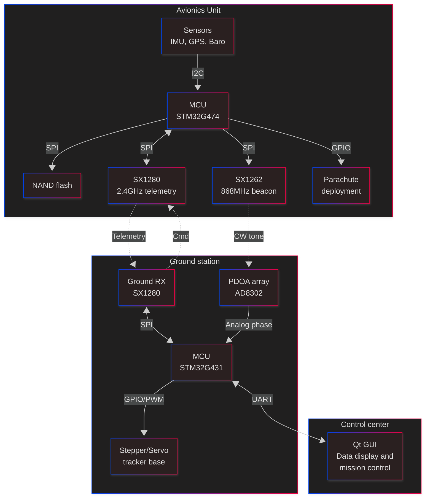

# STM32-based rocket avionics unit and active tracking ground station

 

> **⚠️ NOTE: This project is currently in early active development.**
> See the [Project plan](docs/PROJECT_PLAN.md) for a detailed roadmap and the [Daily log](docs/DAILY_LOG.md) for regular progress updates.

---

## Overview
This project aims to build a robust avionics unit for high power model rocketry. This system will also include a ground station that mechanically rotates high gain antennas to actively track the rocket in real time during flight and receive critical telemetry data.

The system relies on sensor fusion for onboard state estimation and uses a hybrid RF tracking method combining position/movement telemetry and Phase Difference of Arrival (PDOA) signal analysis.

## Key Features
* **Dual-band telemetry:**
    * **2.4GHz (SX1280):** High bandwidth telemetry and command link.
    * **868MHz (SX1262):** Beacon signal for precise PDOA angle tracking.
* **Active ground tracking:** Motorized base with PID control tracks the rocket's azimuth and elevation automatically.
* **Live updating GUI:** See all relevant statistics and flight path updates in real time.
* **Advanced firmware:** Built on STM32 using FreeRTOS for concurrent sensor data acquisition, data logging, RF transmission, and parachute deployment.
* **Safety first:** Robust pre-flight check routine, redundant parachute deployment logic, and failsafe state management.

## System architecture
The project is divided into three main subsystems:

1.  **Avionics (Rocket):** Onboard PCB with flight sensors, NAND flash logging, and RF transceivers controlled by a STM32 NUCLEO-G474RE microcontroller.
2.  **Ground station:** Antenna array with motorised tracking base utilizing position telemetry and PDOA data to maintain a high gain link with the rocket.
3.  **Control center:** PC based GUI for live data visualization and controlling the ground station and avionics unit.

## Repository structure
* `docs/`: Progress logs, planning documents, and testing data.
* `firmware/`: Source code for the avionics and ground station MCUs as well as other prototyping code.
* `hardware/`: KiCad schematics and PCB layouts.
* `mechanical/`: Model files for making various non-electrical parts of the project.
* `software/`: Source code for the control center GUI application.

## Current Status
**Part 1: RF link validation and range tests** (In progress)
- [x] Model and 3D print antenna testing enclosures.
- [ ] Assemble SX1262 and SX1280 test rigs with 1/4 wave ground plane monopole antennas and perform range tests to validate feasibility and collect field data for RSSI and SNR at distance.

*For a day-to-day breakdown of progress, check the [Daily log](docs/DAILY_LOG.md).*

---
*Created by Ryan Hall. Documented as part of a portfolio transition into embedded systems engineering.*