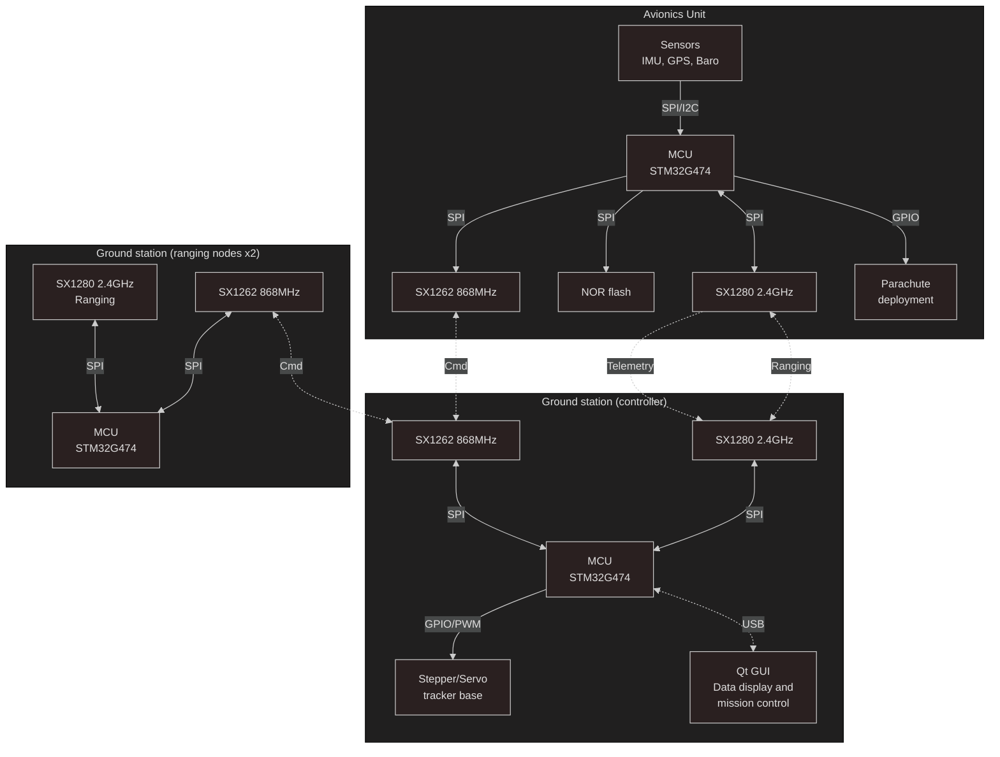

# STM32-based rocket avionics unit and active tracking ground station

 

> **⚠️ NOTE: This project is currently in early active development.**
> See the [project plan](docs/PROJECT_PLAN.md) for a detailed roadmap and the [development log](docs/DEVELOPMENT_LOG.md) for regular progress updates.

---

## Overview
This project aims to build a robust avionics unit for high power model rocketry. This system will also include a ground station that mechanically rotates a high gain antenna to actively track the rocket in real time during flight and receive critical telemetry data.

The system relies on sensor fusion for onboard state estimation and uses a hybrid RF tracking method combining position/movement telemetry received from the rocekt and ranging with several ground nodes to accurately place the rocket.

## Key features
* **Dual-band telemetry:**
    * **2.4GHz (SX1280):** High bandwidth telemetry and ranging.
    * **868MHz (SX1262):** Command link.
* **Active ground tracking:** Motorized base with PID control tracks the rocket's position automatically using two independent data sources (on board avionics and ground ranging).
* **Live updating GUI:** See all relevant statistics and flight path updates in real time.
* **Advanced firmware:** Built on STM32 using FreeRTOS for concurrent sensor data acquisition, data logging, RF transmission, and parachute deployment.
* **Safety first:** Robust pre-flight check routine, redundant parachute deployment logic, and failsafe state management.

## System architecture
The project is divided into three main subsystems:

1.  **Avionics (Rocket):** Onboard PCB with flight sensors, NOR flash logging, and RF transceivers controlled by a STM32G474 microcontroller.
2.  **Ground station:** Network consisting of ranging nodes and a central controlling node with a motorised tracking base utilizing position telemetry to maintain a high gain link with the rocket.
3.  **Control center:** PC based GUI for live data visualization and controlling the ground station and avionics unit.

```mermaid
---
config:
  theme: neo-dark
  layout: dagre
---
flowchart TB
 subgraph Rocket["Avionics Unit"]
        MCU_R["MCU<br>STM32G474"]
        Sensors["Sensors<br>IMU, GPS, Baro"]
        NOR["NOR flash"]
        RKT_24["SX1280 2.4GHz"]
        RKT_868["SX1262 868MHz"]
        Parachute["Parachute<br>deployment"]
  end
 subgraph Air["Ground station (controller)"]
        GS_24["SX1280 2.4GHz"]
        GS_PDOA@{ label: "<span style=\"padding-left:\">SX1262 868MHz</span>" }
        MCU_G@{ label: "MCU<span style=\"padding-left:\"><br>STM32G474</span>" }
        Motors["Stepper/Servo<br>tracker base"]
        GUI["Qt GUI<br>Data display and<br> mission control"]
  end
 subgraph s1["Ground station (ranging nodes x2)"]
        n1["SX1280 2.4GHz<br>Ranging"]
        n2@{ label: "<span style=\"padding-left:\">SX1262 868MHz</span>" }
        n3@{ label: "MCU<span style=\"padding-left:\"><br>STM32G474</span>" }
  end
    Sensors -- SPI/I2C --> MCU_R
    MCU_R -- SPI --> RKT_868 & NOR
    MCU_R <-- SPI --> RKT_24
    MCU_R -- GPIO --> Parachute
    RKT_24 -. Telemetry .-> GS_24
    RKT_868 <-. Cmd .-> GS_PDOA
    GS_24 <-- SPI --> MCU_G
    GS_PDOA <-- SPI --> MCU_G
    MCU_G -- GPIO/PWM --> Motors
    MCU_G <-. USB .-> GUI
    GS_24 <-. Ranging .-> RKT_24
    n1 <-- SPI --> n3
    n2 <-- SPI --> n3
    n2 <-. Cmd .-> GS_PDOA

    GS_PDOA@{ shape: rect}
    MCU_G@{ shape: rect}
    n1@{ shape: rect}
    n2@{ shape: rect}
    n3@{ shape: rect}
```

## Repository structure
* `docs/`: Progress logs, planning documents, and testing data.
* `firmware/`: Source code for the avionics and ground station MCUs as well as other prototyping code.
* `hardware/`: KiCad schematics and PCB layouts.
* `mechanical/`: Model files for making various non-electrical parts of the project.
* `software/`: Source code for the control center GUI application.

## Current status
Goals from the [project plan](docs/PROJECT_PLAN.md) that are currently being worked on:

##### 2\. Avionics unit
* [ ] Write and test routine for downloading data from flash storage.

*For an up to date breakdown of progress, check the [development log](docs/DEVELOPMENT_LOG.md).*
