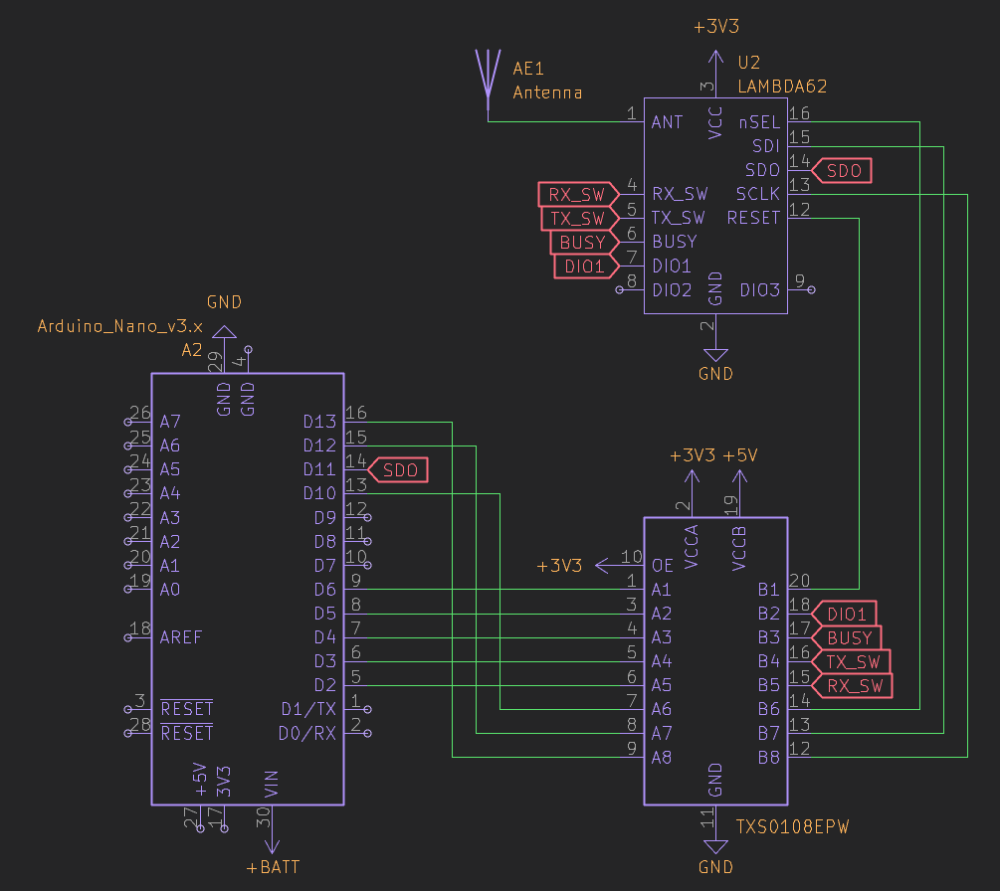
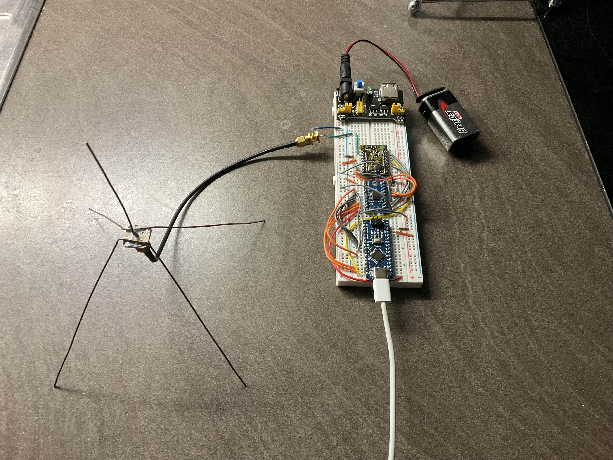
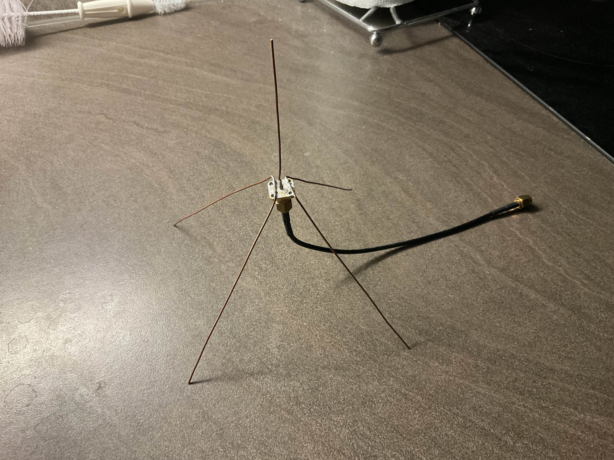
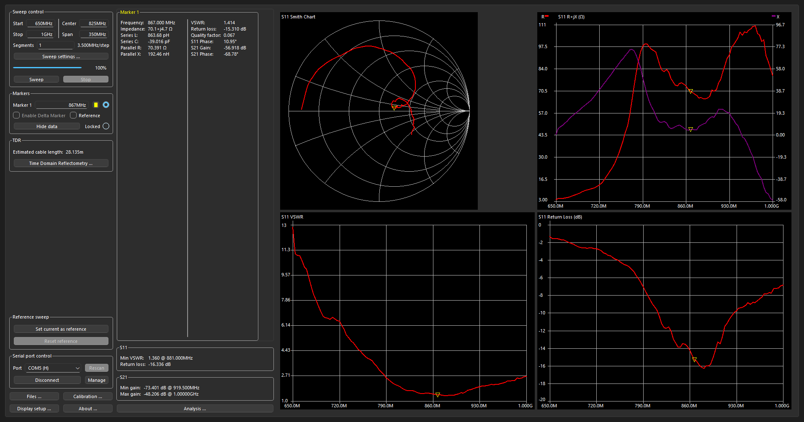
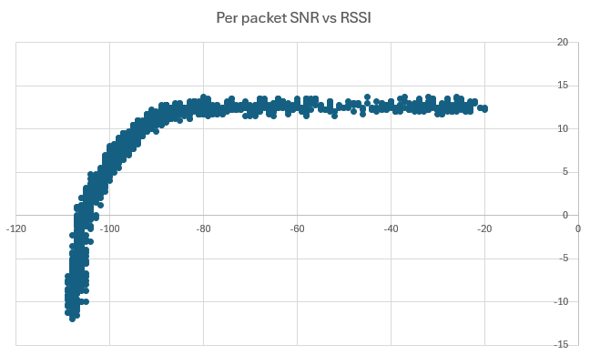
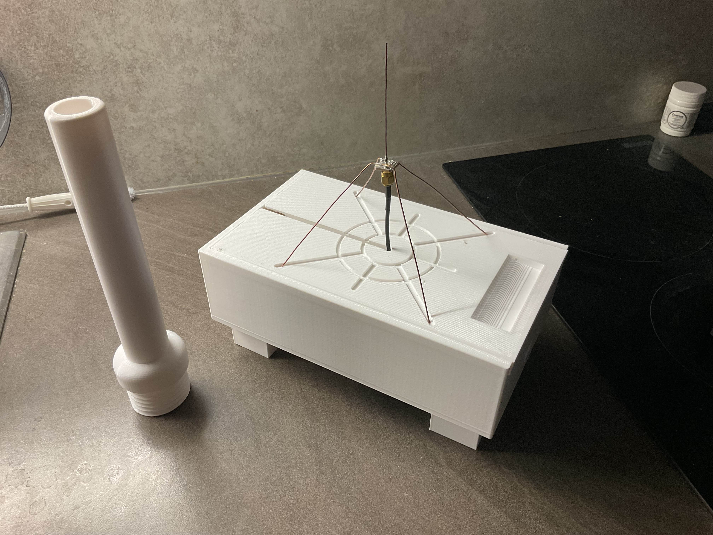
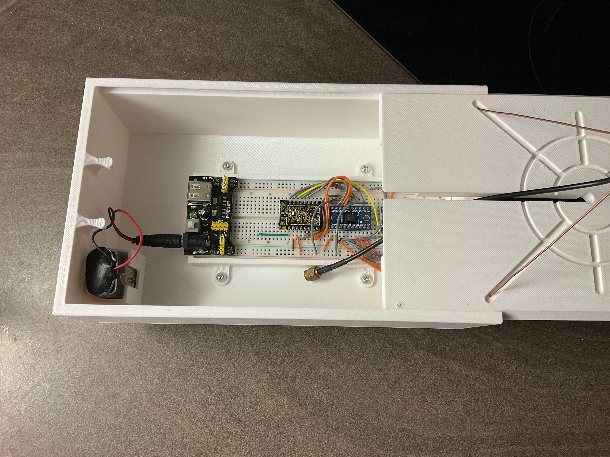

# **Progress log**

Regular detailed progress logs will be written here. Most recent at the top.

---

### Dec 2025 - Jan 2026

This is a summary of the progress made in the first couple months of the project before I started taking logging more seriously.

I started the project by making prototype breadboard circuits to test communication between two LAMBDA62 modules, which contain the SX1262 868MHz transceivers used for this project. Arduino nanos were used to drive the transceivers through TXS0108E bidirectional logic level shifters to match the 5V Arduino logic to the 3.3V logic of the LAMBDA62 module. See the below [wiring schematic](../hardware/prototyping/LAMBDA62_rangetest/RangeTest.kicad_sch) and photo of the assembled rig.

#### Wiring schematic

#### Assembled test rig

The antenna was an 868MHz ground plane monopole made from 1mm diameter bare copper wire soldered onto a SMA female panel mount connector. The monopole was originally cut to be 90mm long while the radials were cut to extend 100mm from the edge of the panel mount. A nanoVNA was used to tune the antenna by cutting the monopole until the point of minimum SWR was close to 868MHz. The final antenna and nanoVNA test results are shown below.

#### Final antenna

#### NanoVNA test results

 

A simple lightweight Arduino sketch ([LAMBDA62_rangetest.ino](../firmware/prototyping/LAMBDA62_rangetest/LAMBDA62_rangetest.ino)) was made to drive the LAMBDA62 using only the SPI library. This sketch can be uploaded to the transmitter and receiver by changing the 'receiver' variable at the top. The transmitter will transmit the payload at the soonest avaiable opportunity with a 20ms delay in between packets and the receiver will receive each packet and determine whether it was sent correctly, along with measuring the strength of the signal. This information is output through the serial port of the Arduino to a connected computer running the [SerialMonitor.py](../firmware/prototyping/LAMBDA62_rangetest/SerialMonitor.py) script, which parses the information and outputs summary statistics every 50 packets to the command line and a text file while writing individual packet statistics to a .csv file.

A range test was conducted on a long flat beach using this setup. The transmitter was stationary on a plastic cutting board on the ground while the receiver was moved away as it received packets. The results can be found [here](./initial_range_tests/01-01-26_results/) graphs of the per packet RSSI/SNR over time and SNR vs RSSI are below. The results were much worse than expected as packets began being missed after only 200m of distance, and all reception was lost after ~600m. However, it is very likely this was caused by bad testing conditions. Placing the transmitter on the ground likely greatly reduced signal transmission efficiency due to ground proximity effects. The weather was very windy which meant the transmitter had to be touched for a significant portion of the test, likely also reducing the antennas radiation effectiveness due to body coupling. In addition, the receiver was moved by holding the breadboard it was attached to and letting it hang underneath held by the coax cable. Walking motions and the wind therefore cause significant polarisation mismatch as the receiver swung around. Another issue encountered during the test was the miscounting of packet sequence numbers by the receiver, causing the missed packet calculations to be significantly off. This issue was not observed during testing before the range test. The issue may have been caused by the receiver not correctly detecting packets with CRC errors, resulting in wrong data being decoded for the sequence number which then throws the calculations off. This was not tested before the first range test as I had no reliable way to induce CRC errors.

#### Per packet RSSI and SNR over time

#### Per packet SNR vs RSSI

Although noisy and less than ideal, the SNR vs RSSI relationship shows promise for the feasibility of using the AD8302 module with 20-30dB gain LNAs for PDOA tracking. The SNR does not begin appreciably dropping until an RSSI of around -90dBm, which shows the 868MHz signal is still received significantly above the noise floor in the RSSI range of the AD8302 (-60dBm) + 20-30dB LNA (-90dBm). Therefore it should be able to reliably process the CW tone uncomplicated by noise until its strength falls out of range.

To ensure the next range test provides more useful results the following modifications will be made:
- Fix the packet sequence number bug which is potentially caused by incorrect handling of erroneous packets. Test this by inducing corrupted packets, potentially by using an implicit/explicit header mismatch between the transmitter and receiver.
- Make a testing enclosure to protect and hold the components in place more rigidly. This will help protect the electronics from outside conditions and hold the antenna in place on an insulating material to ensure a better polarisation match. Additionally, they can be held high off the ground using handle underneath to reduce ground and body coupling effects.

The testing enclosure has been modeled and 3D printed with PETG (see model files [here](../mechanical/simple_range_test/) and images below).

#### Range test enclosure (closed - handle on the left screws into the base)

#### Range test enclosure (open)

