# **Progress log**

Regular detailed progress logs will be written here. Most recent at the top.

---
### Apr 19th 2026

The 3rd board utilising the new V2 design was brought up successfully! Every important line was tested for shorts with a multimeter prior to closing the power isolation jumpers to each section one by one, all of which powered on successfully. The only section not brought up was the magnetometer/barometer section which contained a short between power and ground due to bridging under the MMC5983MA. Due to the lack of a working hot air gun firmware development was started with this section disconnected for a couple of weeks.

#### Firmware development pt.1
Initial tests using STM32CubeIDE with basic startup code showed the MCU was working perfectly and could interface with the peripheral devices like the user LED and accelerometers. The HAL library is used for functions like I2C and SPI communication to handle them robustly and get the board up and running quickly. Currently all communications operate in blocking mode for testing but this will be changed to use non-blocking DMA when moving to an RTOS architecture.

I started by writing drivers to handle the LSM6DSR and ADXL375 accelerometers, both on SPI bus 1. Both are set to sample measurements at 100Hz and send interrupts when their FIFO buffers contain a configurable number of measurements (currently 4). These trigger EXTI interrupts which set a 'data ready' flag and cause the MCU to initiate reading from the FIFO in the next loop. Data from the FIFO is read and the raw bits are converted into readable measurements and stored in buffers which are overwritten each time a new set of measurements comes in.

Before I could develop drivers for the other sensors (GPS, barometer, magnetometer) I had to fix the solder bridging under the MMC as it not only created a dangerous short between power and ground, meaning I couldn't power the magnetometer and barometer, but it also shorted the I2C bus SDA and SCL lines, meaning the GPS on the same bus could not be used.

#### Repairing the MMC
Eventually I got my hot air gun working again and attempted to repair the MMC. I tried applying some flux paste and reflowing with the hot air gun without lifting the chip off first but after a while of heating this did not resolve the bridges. I then tried removing the chip, wicking the pads on the PCB and chip flat, applying a small layer of solder on the PCB pads, and then reflowing the solder with flux while the chip sat on top. This did resolve the bridges and solder the chip properly but the MMC was unresponsive to an I2C scanner or direct I2C communication attempts. I now realise this is likely due to the extreme heat applied to it by prolongued hot air gun heating and wicking the pads with a soldering iron. A second attempt to transplant the MMC from the first PCB attempt (to which power was never applied) also ended identically. The chip soldered well but failed to respond likely again due to extended hot air exposure at temperatures too high. I attempted to solder a third fresh MMC to the board, this time trying to be more cautious with hot air exposure, but it also ended the same way.

It was at this point I realised that too much heat exposure must be the issue. The PCB schematic looked good after triple checking it and the soldering seemed to be working ok, not causing any bridges and soldering the pads properly (checked by testing the input diodes on the pins). I performed a series of thermal tests to identify the most conservative possible hot air conditions I could use to solder the chip from the underside of the PCB to avoid direct hot air exposure (see [thermal tests](../hardware/avionics/avionics_dev_board/Hot%20air%20tests.md)), and switched to using leaded solder to reduce the melting temperature needed. After soldering another fresh MMC using the newly identified more conservative conditions and verifying no shorts were present the board was powered on and the MMC responded to I2C calls! Subsequent software testing revealed that the SET/RESET function of the MMC does not seem to be working so more testing needs to be done to figure out why. The CAP pad may not have soldered correctly for example. This is non essential for the function of the MMC though as a different and more robust reading calibration method will eventually be implemented.

#### Firmware development pt.2
After successful repair of the MMC I was able to develop drivers for all remaining sensors, all of which use the same I2C bus as they are all slower sensors operating at 10Hz. Apart from the MMC SET/RESET issues mentioned above driver development for all these sensors went very smoothly and they all seem to work just fine. I have not been able to fully test the GPS module yet however as testing the board indoors prevents it from acquiring a satellite lock. It does output valid empty NMEA sentences however, so it seems to be working. To fully test it I will need to implement data logging and take it outside.

#### Data logging
Currently I am working on writing a driver for the NOR flash chip to enable data logging and readback. I have implemented a startup function and am currently trying to figure out a good structure to store the data efficiently and robustly. Below is my current plan for storing the data:

Buffers fill up with raw data that has been collected since the last write. Data is logged at 10Hz, at which point whatever is in the buffers is concatenated into a 'packet' that is sent to be written to storage. Each packet has a packet header with a sync word and information about the contents of the packet, followed by each piece of data which have their own headers containing information on the size and type of data they represent.

**Packet structure:**  
\>> 4 Byte start sync word (AABBBBAA)  
\>> 4 byte header: Total number of readings in packet [31:24], Total number of bytes in packet [23:8], Checksum [7:0]  
[[[  
\>> 2 byte header: Data type [15:12], Total number of bytes in data [11:0]  
\>> Raw data (variable length)  
]]] x N

### Note on updates going forward
From now on I am going to try and write these updates more informally and more fequently, almost for every day I work on something ideally. This will mean the updates will be smaller but overall contain much more detail as I will be able to accurately describe everything I've done and the decisions made, which become more difficult to remember after a while. It also reduces the friction to writing these updates which has been a problem. I hope that writing more frequent updates will also serve as a better look into the process, rather than just the results, of this project which I (and hopefully others) can look back on later.

---

### Apr 1st 2026

Further testing of the second avionics dev board ultimately seemed to suggest the board had some sort of catastrophic failure which has now left it unrepairable. Thermal imaging while powering the board bypassing the buck converter using a current limited benchtop power supply set at 500mA showed uniform heating across multiple components (the MCU, GPS module, accelerometers etc.). The amount of heating rose proportionally with the current limit set on the power supply.

#### Thermal imaging of the avionics dev board over time

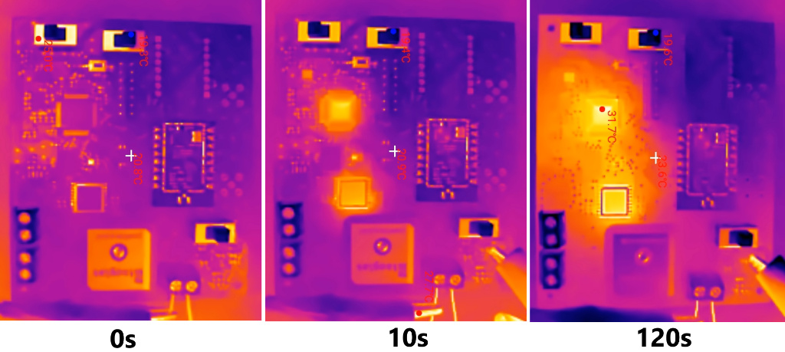

Additionally, attempts to find any dead shorts by measuring the voltage drop between GND and various points around the board gave uniform readings for every point tested. Due to the lack of power isolation mechanisms on the board it was not possible to disconnect sections of the board to test individually, however, after desoldering the inductor in the voltage regulator section to isolate the buck converter from the rest of the board I was able to measure dead shorts on both sides. These tests point towards the chips on the board having been damaged by an overvoltage event during the initial power up, potentially caused by a poorly soldered or dysfunctional buck converter outputting too much voltage.

 

### Avionics dev board V2

To prevent the next board facing the same fate I decided to redesign some parts of the board to improve the bring up phase and testability, as well as adding some extral QoL things. The second version of the avionics dev board includes the following changes from V1:

- Changed SWD interface pins to STDC14 form factor
- Added a user LED and button to the free MCU pins
- Added solid ground and power test points in the middle of the board
- Add jumpers to isolate power to the main power rail and to individual sections of the board
- Switched to using smaller buttons to save space
- Increased distance between headers for the LAMBDA modules as they use non-standard spacing
- Switched to a lower 500mA but slower blowing fuse to prevent potential issues with inrush current
- Rearranged the fuse to be the first component after the power switch
- Decreased resistor values on LEDs from 1kR to 220R

#### Full board view (red = top signal layer, blue = bottom signal layer)

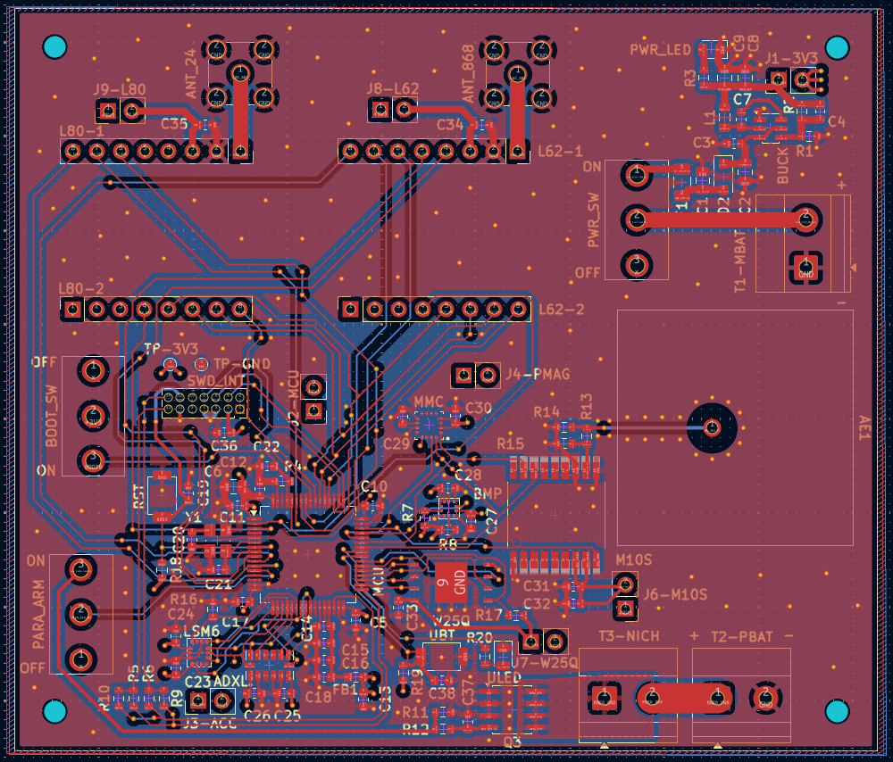

The new PCB design and fresh components were ordered and I have begun assembling the board. I am only assembling components as and when they are required this time to prevent any unneccesary damage if something goes wrong again. So far, all SMD components were soldered via hotplate reflow as before, and the main power terminal, power isolation jumpers, and switches were soldered manually. Extra care was taken to not apply too much solder paste as this may have caused the issues seen in the second attempt of V1. A few minor bridges between MCU and buck converter pins were resolved after reflow though there is still some potential bridging under the MMC magnetometer module which is difficult to assess with my current tools. I have ordered some smaller multimeter test probes to enable easier measurements of lines connecting to the MMC module to help diagnose any potential issues before bringing up the board completely.

Before the potential MMC bridging is resolved though I tested the power regulator section of the board by disconnecting all power isolation jumpers, ensuring the regulator did not connect at all to the rest of the board. First I probed all the pins of the buck converter to ensure there were no shorts and they were connected properly. I also tested a few other parts for shorts and checked diode orientation and fuse continuity. All of these tests passed. Then for an initial test to ensure the buck converter worked safely I used a benchtop power supply to supply 9V at a low current limit of 35mA. When this power was supplied, the buck converter output a stable 3.3V and thermal imaging confirmed no components were heating up substantially.

I next plan to use the multimeter to thoroughly test and resolve any issues with the rest of the board before bringing up each section individually.

---

### Mar 10th 2026

The PCB and components arrived and I was able to assemble the PCB using hotplate reflow. The first attempt went well except for a misaligned MCU which meant each pin in one axis was offset by 1. I tried to correct this by using a hot air station to move the MCU but it seemed to be not heating it well enough to melt the solder. I now know I should have used the hot air station while the board was soaking in 150C heat on the hotplate. Instead I tried using a soldering iron to melt the solder and move the MCU but this resulted in many of the pins being bent beyond repair.

Luckily I had bought two sets of every component for exactly this scenario so I attempted it again the next day. This time making sure the MCU and all other components were more precisely aligned. After reflow all components appeared to be correctly aligned and a few minor bridges between MCU and sensor pins were corrected using the soldering iron. Through hole components were added on to complete the board.

After assembly the board was tested with a fresh 9V battery. Upon flipping the power switch on I saw what looked like a brief flash of light in the voltage regulator area and no light from the power LED. Testing with a multimeter revealed the 1A fuse just before the buck regulator had blown and further testing revealed a short circuit is present between ground and power somewhere on the board. In order to locate the short circuit I have ordered a benchtop power supply and thermal camera to pump a limited current into the circuit and observe hotspots.

#### Assembled dev board in it's current state

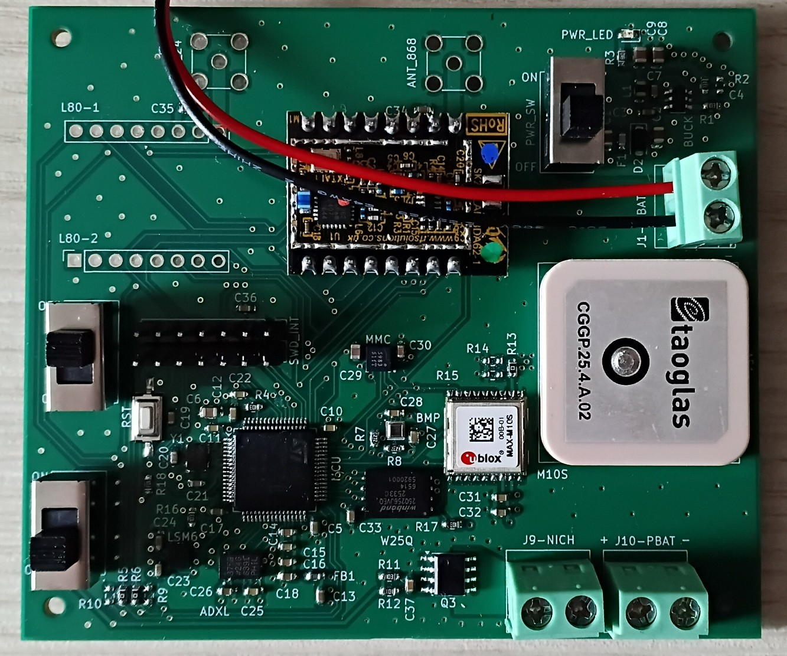

---

### Feb 28th 2026

While waiting for components to arrive I've been learning about the general STM32 MCU startup process and writing some very simple bare metal startup code for the STM32G431KB MCU. This is able to be flashed onto the STM32G431KB-NUCLEO board and the loop counter can be seen increasing using GDB and OpenOCD.

---

### Feb 12th 2026

First design interation of the avionics development PCB has been completed. The PCB and components have been ordered and I will begin assembly and testing when they arrive.

#### Full board view (red = top signal layer, blue = bottom signal layer)

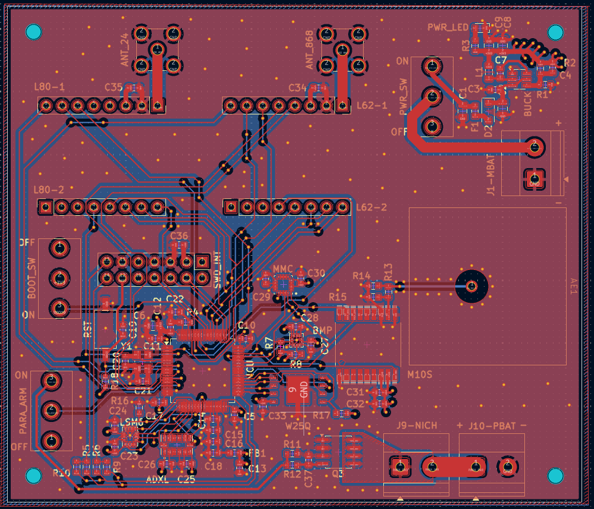

The board is organised roughly into 5 sections:
- Top right: Power supply and voltage regulator. Power is supplied by a 9V battery across the J1 terminal and stepped down to 3V3 by a TPS563201 buck converter.
- Top middle/left: LoRa transceivers and antenna SMA connections.
- Middle right: GPS module and antenna.
- Bottom right: Parachute deployment system. Utilises a separate power supply driven by a MOSFET to burn a length of nichrome wire.
- Bottom left: Main MCU and sensor block.

This board uses a 4 layer stackup of SIG-GND-PWR-SIG, enabling easy distribution of power throughout the board. To minimise return path issues, only not critical signals are routed on the bottom signal layer with the power layer as it's reference. The only signal this was not possible for is the GPS antenna line, for which a separate island was made on the power layer surrounding the trace tightly coupled to ground using many vias. Along with this, 4 vias were placed to surround the signal via when it transitions back up to the top layer to ensure it always maintains a close ground reference.

#### GPS antenna trace shielding

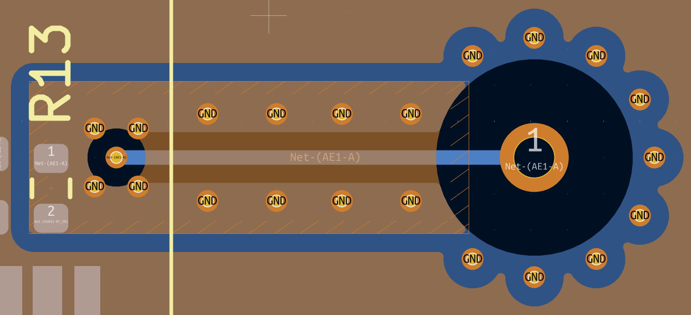

0602 footprints were used for most passives except large value capacitors. I plan to assemble the board using a stencil to apply solder paste and a hot plate to reflow. Through hole components can then be soldered manually afterwards.

---

### Feb 1st 2026

The issue causing miscounting of packet sequence numbers by the receiver in the LAMBDA62 rangetest setup has been identified and fixed. Testing confirmed this was caused by the transmitter repeatedly resetting and starting the transmission counter from 0 again. The 9V battery powering the transmitter was outputting a much lower voltage than expected (around 7V, while the receiver battery output almost 9V) so a fresh battery was used. This fixed the issue and transmission was able to continue uninterrupted while the receiver correctly counted each packet. To mitigate the chance of this issue happening in the field spare batteries will be brought.

Component selections for the avionics unit have been finalised. Changes from the previous selections are detailed below:

- MCU = STM32G474RET6; The chip will be used rather than a nucleo board for compactness and to reduce cost.
- Storage = W25Q256JVEIQ; NOR flash will be used instead of NAND flash to increase reliability for storing critical flight data. This still offers more than enough storage capacity to write flight data for multiple long launches if needed.
- IMU = LSM6DSR; Switched to the R variant for lower risk of gyro saturation for negligible increase in cost.
- Pressure/temp = BMP581; Mainly due to lack of availability of the BMP390, but also slightly increased sensitivity.
- Magnetometer = MMC5983MA; Highly improved performance with degaussing option to remove offsets caused by other nearby components.

---

### Jan 28th 2026

Started designing the development PCB for the avionics unit, beginning with the power source. This utilises a TPS563201 buck converter to provide a stable 3.3V DC source from a 4.5V-17V input. Component values were taken from the datasheet specifications with resistor R2 being 33kΩ to get a 3.3V output. A space for capacitor C4 was added despite likely being unneeded so that the pads are there for easy addition later if testing shows it is needed. A switch was also added between the positive terminal input and the TPS563201 enable pin to allow the power source to be easily switched on and off. Temporary footprints have been used for the moment until actual component models are decided.

#### Schematic view

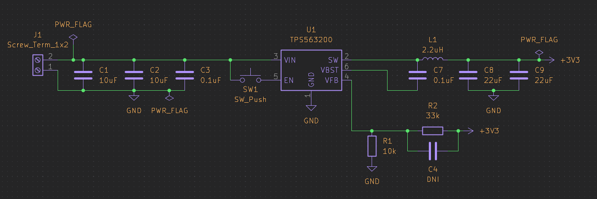

#### PCB view

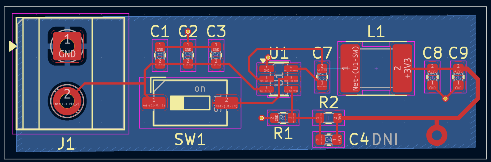

#### 3D view

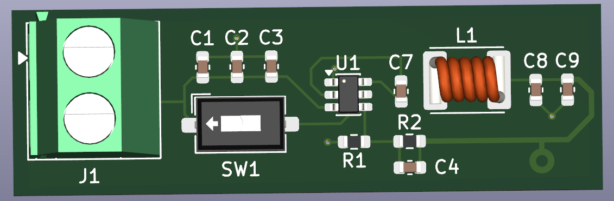

---

### Dec 2025 - Jan 2026

This is a summary of the progress made in the first couple months of the project before I started taking logging more seriously.

I started the project by making prototype breadboard circuits to test communication between two LAMBDA62 modules, which contain the SX1262 868MHz transceivers used for this project. Arduino nanos were used to drive the transceivers through TXS0108E bidirectional logic level shifters to match the 5V Arduino logic to the 3.3V logic of the LAMBDA62 module. See the below [wiring schematic](../hardware/prototyping/LAMBDA62_rangetest/RangeTest.kicad_sch) and photo of the assembled rig.

#### Wiring schematic

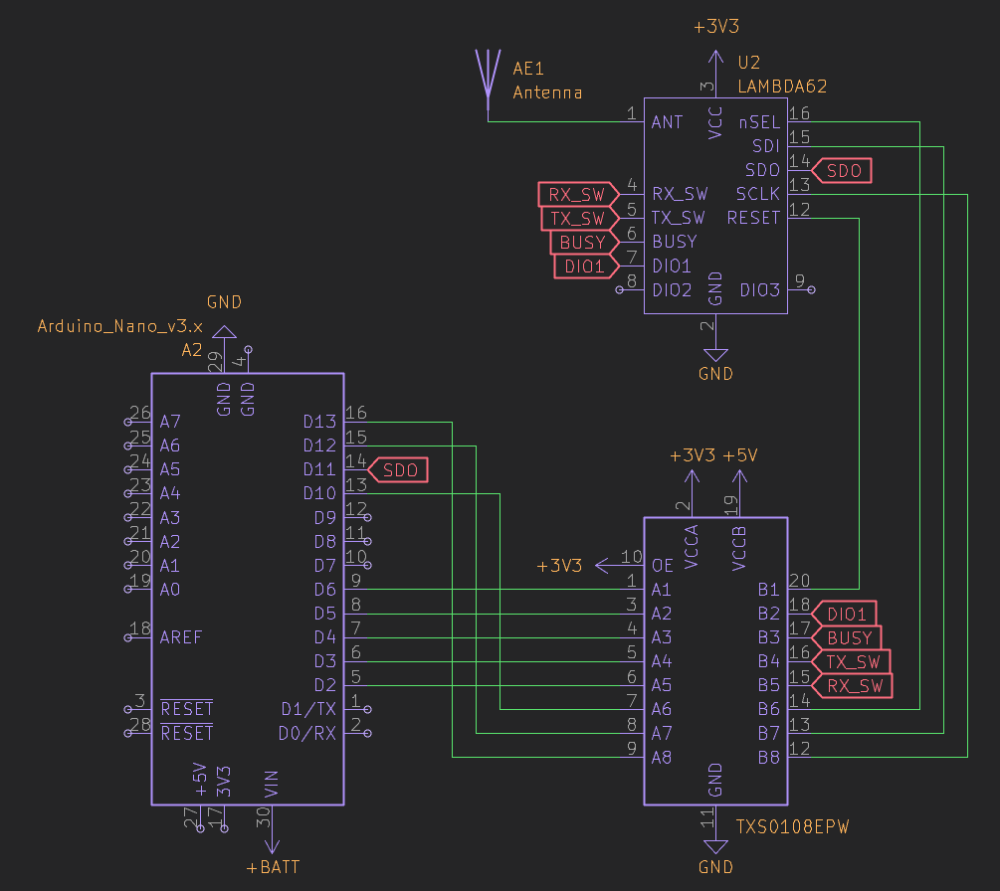

#### Assembled test rig

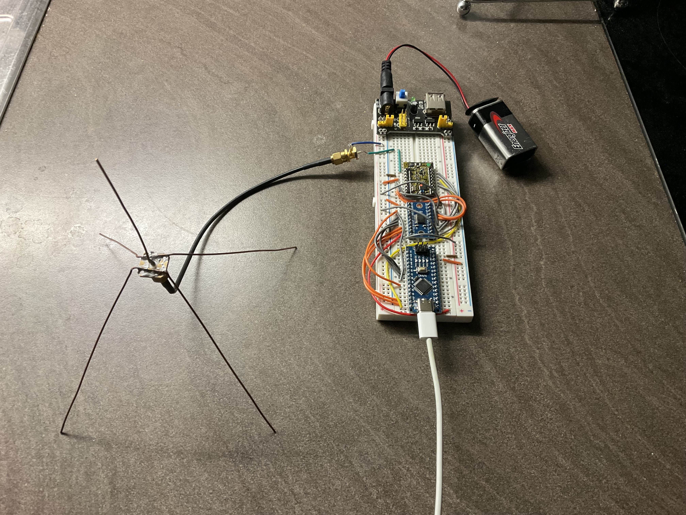

The antenna was an 868MHz ground plane monopole made from 1mm diameter bare copper wire soldered onto a SMA female panel mount connector. The monopole was originally cut to be 90mm long while the radials were cut to extend 100mm from the edge of the panel mount. A nanoVNA was used to tune the antenna by cutting the monopole until the point of minimum SWR was close to 868MHz. The final antenna and nanoVNA test results are shown below.

#### Final antenna

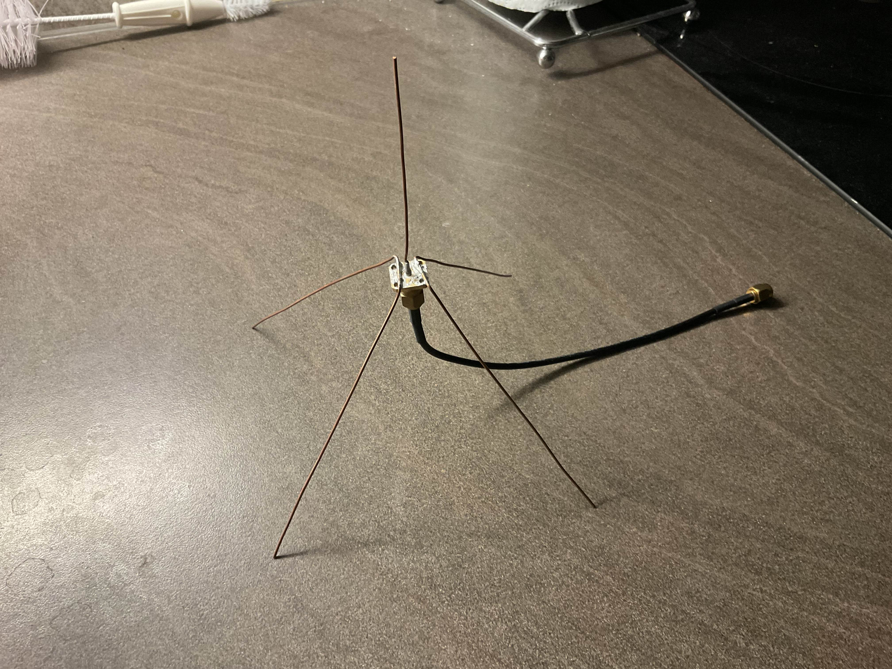

#### NanoVNA test results

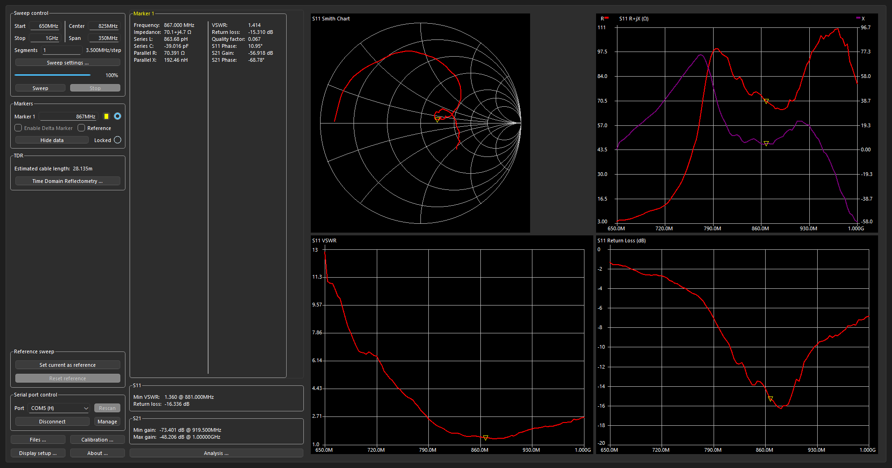

 

A simple lightweight Arduino sketch ([LAMBDA62_rangetest.ino](../firmware/prototyping/LAMBDA62_rangetest/LAMBDA62_rangetest.ino)) was made to drive the LAMBDA62 using only the SPI library. This sketch can be uploaded to the transmitter and receiver by changing the 'receiver' variable at the top. The transmitter will transmit the payload at the soonest avaiable opportunity with a 20ms delay in between packets and the receiver will receive each packet and determine whether it was sent correctly, along with measuring the strength of the signal. This information is output through the serial port of the Arduino to a connected computer running the [SerialMonitor.py](../firmware/prototyping/LAMBDA62_rangetest/SerialMonitor.py) script, which parses the information and outputs summary statistics every 50 packets to the command line and a text file while writing individual packet statistics to a .csv file.

A range test was conducted on a long flat beach using this setup. The transmitter was stationary on a plastic cutting board on the ground while the receiver was moved away as it received packets. The results can be found [here](./initial_range_tests/01-01-26_results/) graphs of the per packet RSSI/SNR over time and SNR vs RSSI are below. The results were much worse than expected as packets began being missed after only 200m of distance, and all reception was lost after ~600m. However, it is very likely this was caused by bad testing conditions. Placing the transmitter on the ground likely greatly reduced signal transmission efficiency due to ground proximity effects. The weather was very windy which meant the transmitter had to be touched for a significant portion of the test, likely also reducing the antennas radiation effectiveness due to body coupling. In addition, the receiver was moved by holding the breadboard it was attached to and letting it hang underneath held by the coax cable. Walking motions and the wind therefore cause significant polarisation mismatch as the receiver swung around. Another issue encountered during the test was the miscounting of packet sequence numbers by the receiver, causing the missed packet calculations to be significantly off. This issue was not observed during testing before the range test. The issue may have been caused by the receiver not correctly detecting packets with CRC errors, resulting in wrong data being decoded for the sequence number which then throws the calculations off. This was not tested before the first range test as I had no reliable way to induce CRC errors.

#### Per packet RSSI and SNR over time

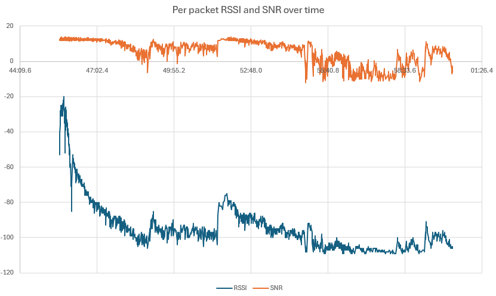

#### Per packet SNR vs RSSI

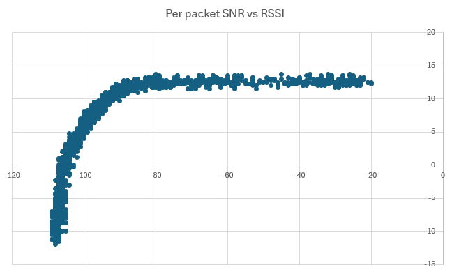

Although noisy and less than ideal, the SNR vs RSSI relationship shows promise for the feasibility of using the AD8302 module with 20-30dB gain LNAs for PDOA tracking. The SNR does not begin appreciably dropping until an RSSI of around -90dBm, which shows the 868MHz signal is still received significantly above the noise floor in the RSSI range of the AD8302 (-60dBm) + 20-30dB LNA (-90dBm). Therefore it should be able to reliably process the CW tone uncomplicated by noise until its strength falls out of range.

To ensure the next range test provides more useful results the following modifications will be made:
- Fix the packet sequence number bug which is potentially caused by incorrect handling of erroneous packets. Test this by inducing corrupted packets, potentially by using an implicit/explicit header mismatch between the transmitter and receiver.
- Make a testing enclosure to protect and hold the components in place more rigidly. This will help protect the electronics from outside conditions and hold the antenna in place on an insulating material to ensure a better polarisation match. Additionally, they can be held high off the ground using handle underneath to reduce ground and body coupling effects.

The testing enclosure has been modeled and 3D printed with PETG (see model files [here](../mechanical/simple_range_test/) and images below).

#### Range test enclosure (closed - handle on the left screws into the base)

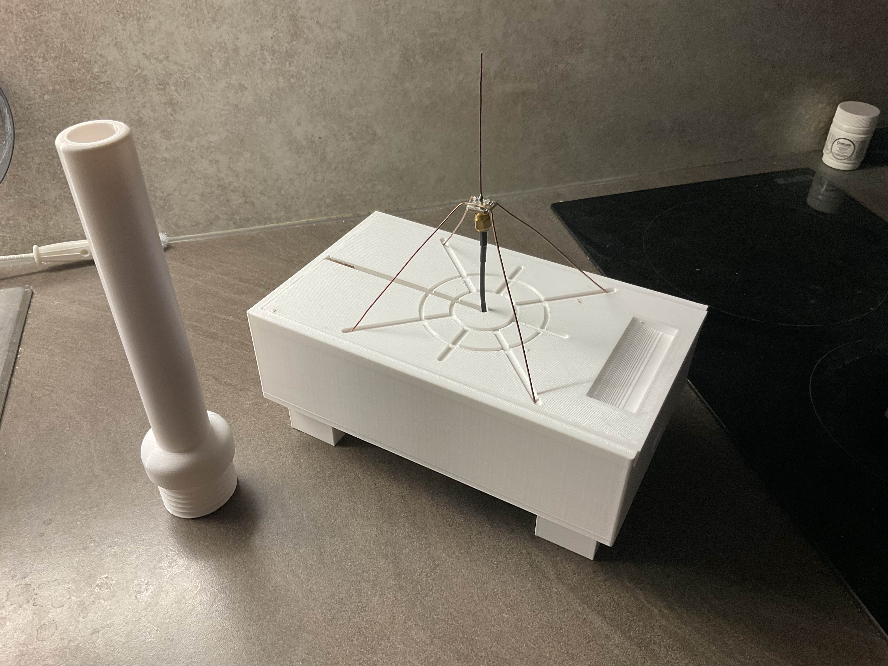

#### Range test enclosure (open)

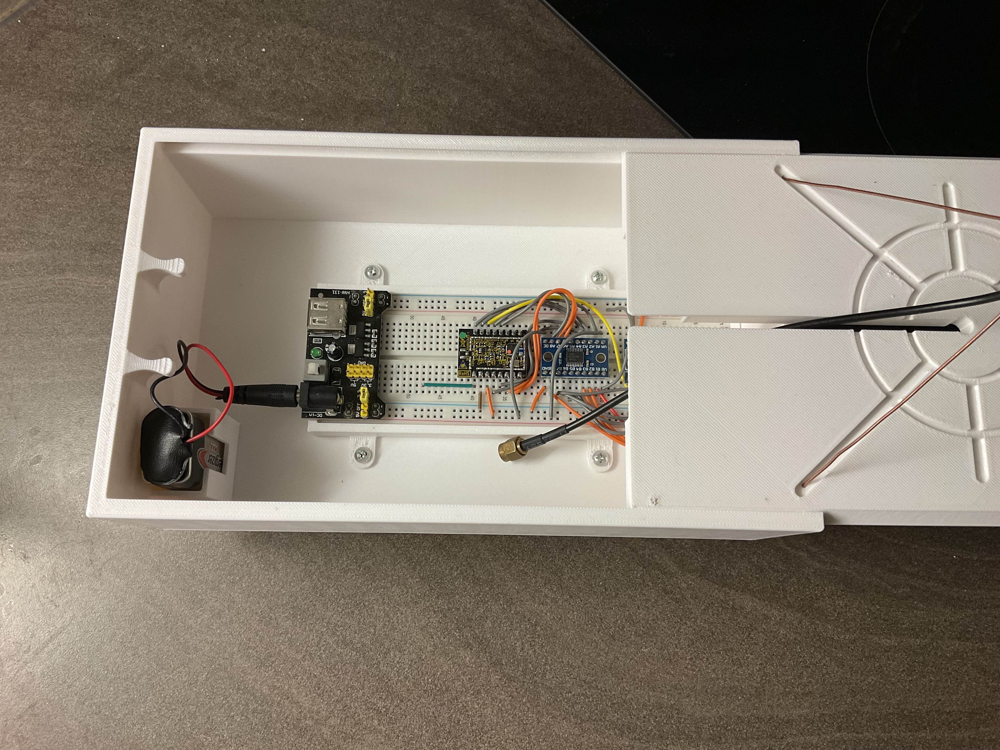

