# **Progress log**

Regular detailed progress logs will be written here. Most recent at the top.

---
### July 17th 2026

The data calibration stage has been completed successfully! I have written 3 python scripts which take in the raw binary data downloaded from the avionics unit and use it to calibrate the magnetometer, both accelerometers, and the gyroscope.

The gyroscope is the easiest to calibrate. Although scale factor and cross axis alignment issues can exist for gyroscopes, they are generally quite well calibrated from the factory, and it isn't really practical for me to make the precise setup required to calibrate these things without launching an entirely new project. Therefore, I decided to only focus on the other easy thing to calibrate which is the zero-rate offset. For this I recorded some data for around a minute while the unit was sitting perfectly still. The first and last 2 seconds of the data is filtered out to remove spikes caused by the pressing of the start/stop button from affecting the calibration. Then the average value for each axis was simply averaged and negated to get the offset that needs to be added to each reading. Below is the results of calibrating the gyroscope data:

#### Gyroscope calibration

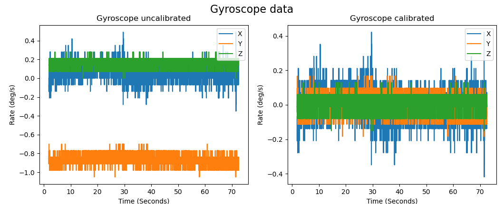

Next is the magnetometer. For this I used an ellipsoid fitting algorithm to correct both hard and soft iron interference. This algorithm uses least squares to fit an ellipsoid to the uncalibrated data, and then find the transforms needed to turn the ellipsoid back into a unit sphere centered at the origin. Data was collected by taking measurements continuously while I spun the unit around in my hands at all angles. Below is the results of calibrating the magnetometer data:

#### Magnetometer calibration (red wireframe is the ideal unit sphere with a red cross at it's center)

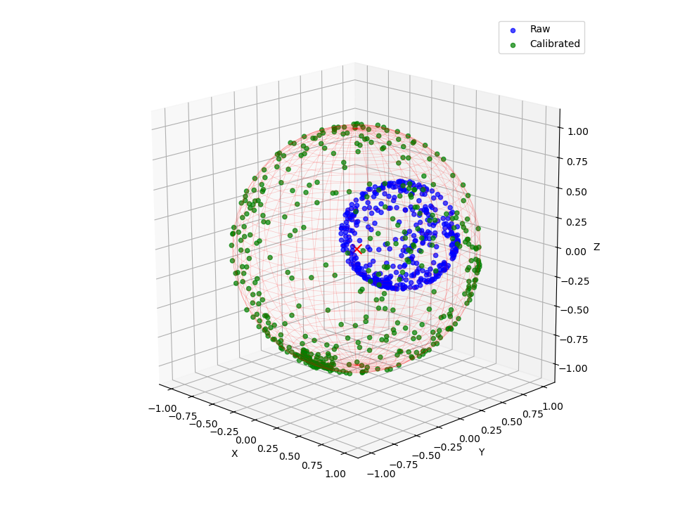

Finally, the accelerometers. For this I use the same ellipsoid fitting algorithm as used for the magnetometer, but with some differences in data collection and processing before calibration. While the magnetometer measures Earths magnetic field and is not affected by the movement of my hand when rotating it, the accelerometers measure gravity PLUS any additional movement when rotating it around. This will obviously throw off the calibration as it expects the magnitude of the measured force to be exactly 1, so I adapted my strategy to get more stable readings. Instead of rotating the unit in my hands, I 3d printed a roll cage which holds the avionics unit in it's enclosure rigidly in the center. This can then be placed in a bowl and rotated to any angle, and there is enough friction to hold it perfectly still.

#### Accelerometer calibration roll cage in a plastic bowl with the avionics unit held in the center

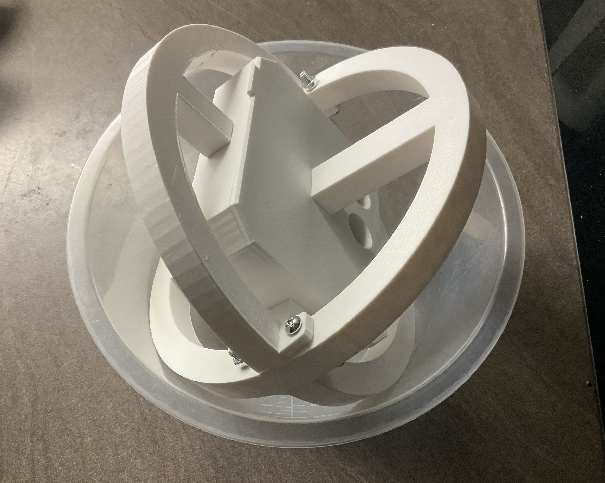

Data was recorded continuously as I rotated the unit to various angles in the bowl, stopping for a few seconds at each angle to allow all vibrations to settle and get a stable reading. Of course, the raw data now contains both the stable periods and the movement when I'm rotating it in the bowl, so before calibration I added logic to first filter out all the unstable periods. To do this I calculated the variance with a rolling window of 50 measurements (half a second), and selected only data where the variance is below a threshold. I also added an additional filter to remove data recorded within 100ms of the threshold being crossed (either at the beginning or end of a settled period) as an additional buffer against including bad data. This gave nice clean measurements at various angles from only periods where the unit was completely settled.

The high-G accelerometer presented an additional problem because it has a very high baseline of noise in this low acceleration environment, meaning settled periods could not be picked out due to the noise completely swamping out the additional variance caused by movements. Therefore, I utilised the timestamps of the settled periods determined from the low-G data to filter the high-G data to only include measurements done within these same periods. This was not enough however, as the extremely high baseline noise meant an ellipsoid could not be fit well to the data, even after filtering. Therefore, an additional averaging step was introduced. For each settled period, all measurements were averaged to produce a single more stable measurement. This was done for both the high and low G data for consistency. Using this averaging method, I was able to get a good ellipsoid fit from 38 data points (one for each settled orientation) and nicely correct the high-G accelerometer data despite the extreme noise level. Below is the results of calibrating the accelerometer data:

#### Accelerometer calibration (red wireframe is the ideal unit sphere with a red cross at it's center)

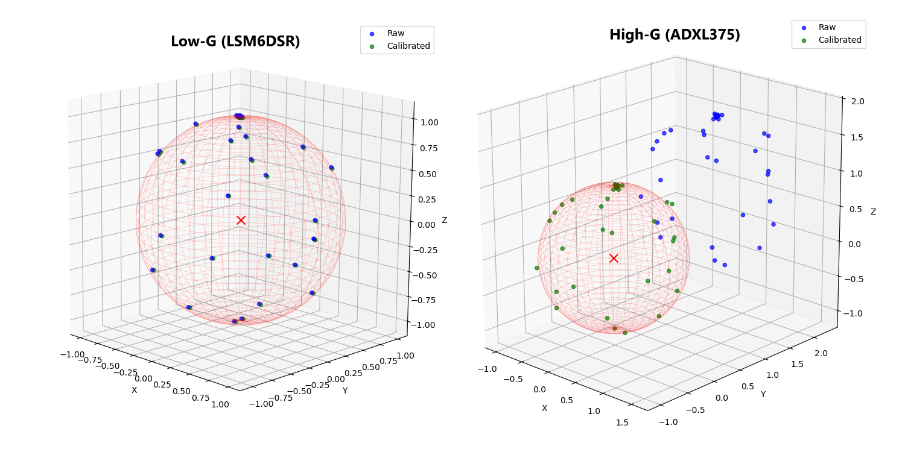

---
### July 16th 2026

Over the past ~2 weeks I have been working on the goals I set in the last update, and I'm happy to say all of them have now been completed!

#### Improved antenna design

After a few attempts I managed to successfully make and tune a pair of 868MHz sleeve dipole antennas. I made them by stripping a piece of RG316 coax cable to remove all but the inner conductor for around 80mm to make the top half of the dipole. Then I used a piece of 6mm diameter 0.5mm thickness copper tubing cut to around the same length for the second half of the dipole, soldered to the outer braid at the base of the exposed inner conductor portion. To keep the coax centered in the tubing I applied a few layers of heat shrink at 2 points along the length of the coax to be covered by the tubing, ensuring they were as thin as possible to not affect the velocity factor of the gap too much (this was learned the hard way with one failed attempt that used far too much heat shrink!). I also covered the exposed inner conductor in heat shrink for added stability and protection. I left a bit of length under the tubing to clip on a ferrite bead and then soldered an SMA male connector before tuning using a nanoVNA. After tuning, the inner conductor has a final length of 82mm and the tubing has a final length of 73mm.

I then 3d printed some enclosures to protect and stabilise the antennas further. These enclosures do slightly detune the antennas, making their resonant frequency decrease slightly, but the SWR at 868MHz is still <2.0 so I plan to leave them as they are currently until I know the exact final design of their environment so I can perfectly tune them at that point.

#### Sleeve dipole design (top: uncovered, bottom: in enclosure)

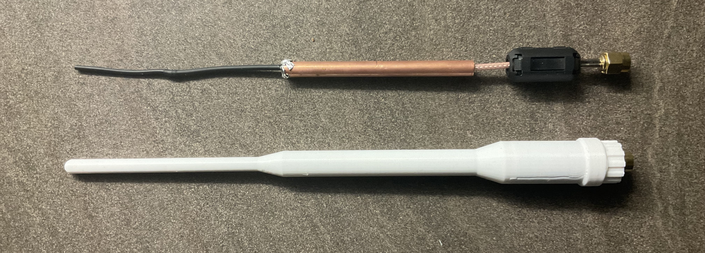

#### Sleeve dipole final tuned nanoVNA reading (no enclosure)

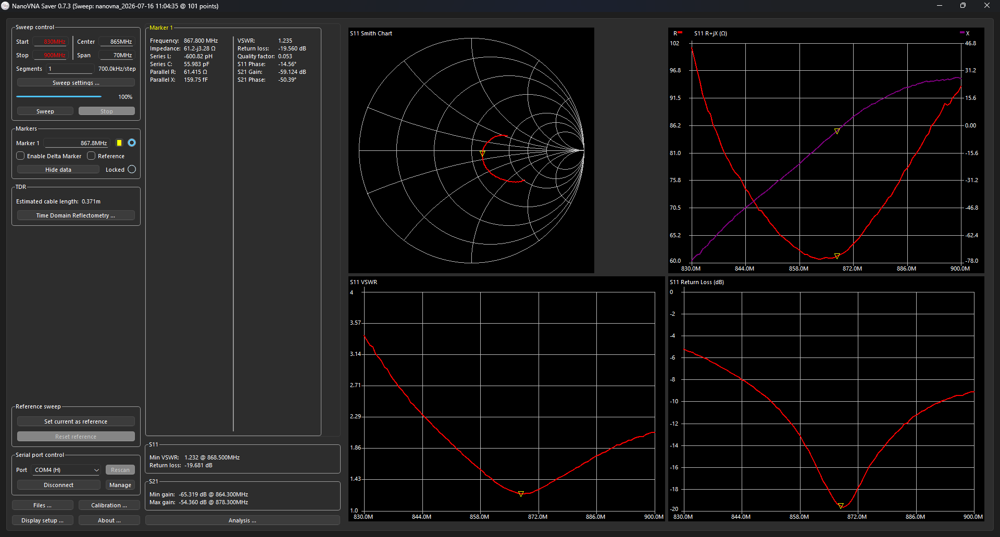

I have only made the 868MHz versions of these for now as my nanoVNA is the H4 variant which can only measure up to 1.5GHz. I have ordered a liteVNA which I will use to make the 2.4GHz variants once they arrive. It will also be more accurate for the 868MHz version too as it doesn't use harmonics to measure above 300MHz.

#### Data download routine

After making the sleeve dipoles I worked on making a robust data download routine to get stored data off the avionics unit and onto the host PC connected to the controller. The way this works is as follows:
- The controller first requests information on how many bytes of data are stored on the avionics unit over 868MHz and relays the information to the host PC.
- Once received, the controller can send a request over 868MHz to download a specific chunk of data by sending the number of bytes to download and the number of bytes offset to start reading from (or just 0s for all available data). The avionics unit will then continuously read chunks of data in the requested block and send them over 2.4GHz to the controller. The controller relays the received data to the host PC over USB.
- The host PC tracks missing blocks of packets based on the sequence number in the first 4 bytes of each packet, and if there are no additional packets received after 500ms it is assumed the transaction has ended.
- Based on the sequence numbers received, the length of data in the first received packet, and the number of requested bytes, the host PC determines which contiguous chunks of data are missing and sends another download command for each chunk, setting the number of bytes and offset values to get the correct chunk.
- This repeats until all data has been received correctly, as which point the data from all packets are concatenated into a binary file and written to disk.

This download routine seems to work well except in rare circumstances where some chunks of data seem to never be received correctly, no matter how many times they are requested. This is usually fixed by simply rerunning the routine, and it happens rare enough that I have decided not to spend too much time on it currently and work on more important stuff. Over time I'm sure I can make this routine more reliable, but for now it works well enough that I am not going to worry about it.

#### Sensor reading and data logging

I have reintegrated all the sensors into the avionics firmware in a FreeRTOS friendly way. All sensors except the GPS use interrupts to release tasks to read their data. tue to the lack of an interrupt signal the GPS must be polled which is done using a timer to trigger the polling task at 4Hz (twice the expected data rate). Additionally, previously the initialisation functions of each sensor immediately started measurements with no way to stop it. Now I have updated all the sensor drivers so they start in a 'dormant' state, primed to start measurements but not actually taking them yet. Then when ready, the main firmware can call wake up functions to start/stop measurement output for each sensor. This prevents a bunch of stale measurements building up and blocking interrupts when not needed.

To log data, each sensor reading converts the gathered data into a standardised struct containing a union of all datatypes and an identifier enum for each type of sensor data, which is then pushed onto a queue. The data logging task constantly pulls from this queue and serialises the data into a byte array which can be appended to the local write buffer. Every 100ms, driven by a timer, a task notification is released allowing the task to write the contents of the buffer to the NOR flash chip at the end of the data section. The end pointer for the write buffer is then reset and the task continues accumulating data for the next write interval. Since this is a large write operation I want to eventually use DMA for the SPI transaction but for now it is blocking.

#### Field test of data collection

With that all set up I attempted the first real field tests to ensure all sensors work correctly and gather data for analysis. To do this I 3D printed some new enclosures for the PCBs and took the avionics unit to an open field to ensure the GPS antenna had clear line of sight and there are no surrounding structures to interfere with the magnetometer. In the first test run all sensors appeared to work except the GPS, which output no measurements. This was caused by the original method of stopping/starting measurements which was to use software backup mode. This mode wipes the stored configuration in RAM which cleared the initialisation config once it was woken again. I implemented a better method which is to enable/disable the output of RMC and GGA NMEA sentences over I2C. This has the effect of stopping data output but keeps the device in full operation so the RAM contents is not cleared. After this change measurements were being output and the second field test at the same location showed all sensors including the GPS working. The GPS was also very accurate even when using the air +-4g dynamic platform model. Apart from a few discrepancies, all lat/long measurements were within 1-2m of my actual location at the time. The altitude measurements were more off (typically ~5m away from the actual altitude) but still fairly close. The GPS also did not lose it's lock when the PCB was fully enclosed in 3D printed PETG and the antenna was pointed at the ground or perpendicular to the sky which is promising.

#### Example field test data from one run

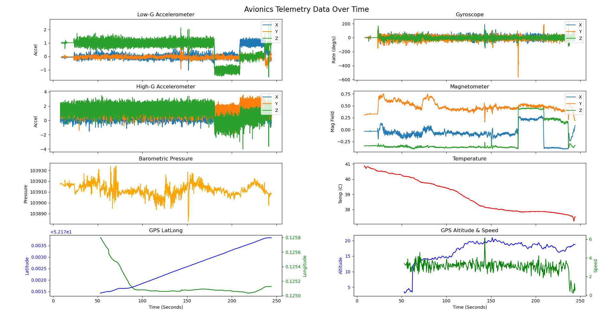

Overall, the sensor data seems very good! I gathered a bunch of data in the field which I now plan to use to get into the meat of the project, the sensor fusion and data integration algorithm. I have no idea how long this will take, but my goal is to first write algorithms to calibrate the accelerometers, gyroscope, and magnetometer, and then write an algorithm that can fuse all sensor data to output one robust estimate of position and movement. I will prototype this on PC first, and then attempt to translate it into efficient C code that can be run on the avionics unit once it is working well.

---
### July 1st 2026

#### Range test results

On Saturday 27th I conducted the range test on Holkham beach in Norfolk. Unfortunately it didn't go as smoothly as I had hoped because both of the radiating elements on the controlling node antennas snapped off in transit. Since we were on a beach with no equipment I couldn't repair them properly, but in an effort to make sure I got *something* I attempted to temporarily attach the snapped elements back on using some bits of metal bent out of shape to grip it. This did work and the transceivers were able to talk to each other, though I imagine it would definitely have negatively affected the results as the length of the elements was no longer precise, and the grip was quite weak so they did end up moving a lot during the test. In addition, since the antenna elements were essentially holding on by a thread, I had to settle for laying it on my bag on the ground so it was stable. If I had attempted to hold it up in the air as I had originally planned they would have almost certainly fallen off again.

So not ideal and I will definitely be repeating it taking more precautions to get it there in one piece, but for now I do have this data:

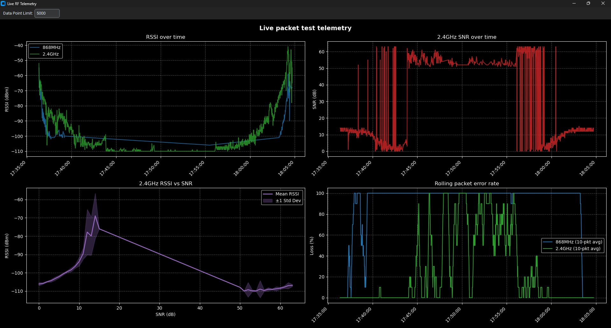

These graphs were obtained during the test, where the controller was on the ground and the receiver was walked away around 1.5m off the ground before coming back again in the second half. There are graphs of RSSI over time for both frequencies, SNR for 2.4GHz, RSSI vs SNR for 2.4GHz, and rolling 10-packet error/missing rate for both frequencies.

The 2.4GHz signal seems to have travelled much further than 868MHz which is expected due to the fact that it uses LoRa rather than GFSK. At the stopping point (~550m away) before turning around and walking back I actually decided to risk it and hold the controller off the ground slightly (maybe only about 60-80cm) and it did regain signal again. That is the sudden jump up in 2.4GHz RSSI you can see in the second half of that graph. So maybe if I didn't have to worry about the elements falling off it could have gone further. In the end it seems like the 868MHz signal stopped entirely at only around 100m, while 2.4GHz could have potentially gone further than 550m. The lower limit of RSSI where packets were detected seems to have been -110dbm for 2.4GHz and -100dbm for 868MHz, which are both around 5dbm higher than the transceiver sensitivities would suggest. I was hoping for better results, but I think given the issues with the broken antennas I can't really complain too much.

There was also an issue with the SNR jumping up to the 50-60 range when it get's too low. This is due to mistakenly interpreting the SNR value as an unsigned integer when it should be a signed integer, meaning negative values wrapped around.

#### Next steps

This range test highlighted a few key issues that need to be addressed in the next test. It will likely be a while before I have another opportunity to do a range test so I have plenty of time to prepare.

Here are a few things I am thinking to improve reliability and get the most insight out of the next test:
- Replace the antenna design with sleeve dipoles. Currently I am using ground plane monopoles which, especially for the 868MHz ones, are quite bulky due to the five elements all sticking out at angles. This is the main reason two of them were broken in transit, and it also necessitates a bit of an awkward enclosure design to hold them out away from the PCB which makes the enclosures awkward to transport too. Switching to sleeve dipoles will enable a much cleaner, compact, and robust setup as the antennas can stand straight up attached to the PCB SMA connectors and it will be easier to detach and reattach them for transit.
- Redesign improved enclosures for the PCBs which are more portable and have attachment points on the bottom to enable them to stand on top of some sort of mast to lift them off the ground.
- During this test distance was recorded by the person walking using their phones GPS. Eventually I want to use the 2.4GHz transceivers ranging function, so to test that I could set up the test so that between each test packet the 2.4GHz transceivers range each other and record that distance. This can then be compared to the GPS distance to see how accurate it is.

Since it will be a while before the next testing opportunity I don't need to do all of this now, so I plan to redesign the antennas and enclosures and then work on other stuff until the next opportunity comes around. Here is what I plan to do over the next few weeks:

By 5th Jul: Build and test sleeve dipole antennas. Design new enclosures for the PCBs with sleeve dipole antennas.
By 17th Jul: Write and test robust data download routine. Reintegrate avionics sensor reading and storage writing tasks in FreeRTOS.
By 19th Jul: Collect field test data on avionics board. Start working on calibration and data integration algorithms.

I may be able to get all this done faster than the dates written here but I've just given myself more time in case I run into any issues which take a while to solve, which probably will happen! I plan to try making my own sleeve dipoles first but if it takes too long then I will just use commercially made ones as I don't want to be spending ages held up making antennas, which isn't really the main focus of this project.

---
### June 26th 2026

Over the past 2 weeks I have been working on getting both the RF controller and avionics boards in a state where they can be used for a more robust range test of the transceivers. There were a few challenges which took a while to figure out but they are finally ready to go now I think!

Both boards are now fully able to handle RF communication between each other. The firmware uses shared drivers for the low level functionality of each transceiver (SX1280 and SX1262) while the main file implements the specific handling of the data going to and from the transceivers. For each transceiver there is a FreeRTOS task driven by a task notification which reads any incoming packets, deconstructs them into a standardised packet struct, and places them in a queue ready to be received by the transcation manager task. Since the SPI bus is shared between the transceivers, all operations are protected by a mutex to prevent collisions on the bus.

The transaction manager task operates a state machine that calls specific handler functions based on the current state it is in. These handler functions all take in the most recently received radio packet (and USB packet for the controller) and return the state the transaction manager should switch to when it finishes (which can just be the same state). The default state is the idle state, in which the controller will continuously check the USB command queue for new commands to execute while the avionics will check the radio queue to check for new radio commands to execute. Once a command is received it will return the new active state, causing the transaction manager to execute the handler function. This architecture allows for easy maintainability and expansion later with new commands as each state has it's own separate handler function which can lead into any other if required for complex protocols.

So far I have implemented 2 basic protocols for the boards to communicate over RF:
- The first is the discovery command, which runs every X seconds (currently 4s) on the controller and is independent of any user supplied USB command. In this state the controller first broadcasts a discovery packet to the network broadcast address (0xFF) and waits 500ms for any replies. Once received by the avionics board, it will send back an ACK packet to the controllers network address to notify it is ready to go. Currently replies received by the controller are simply sent as a status packet over USB to the host PC.
- The second is the packet test command. This command is started by the user sending a packet test start command over USB and is intended for testing round trip packet reception with a specific network node. The user supplies the target network address and the controller then begins sending packet test packets to that address which contain a byte representing the channel the request was made on (0 = 868MHz, 1 = 2.4GHz) and 4 bytes for a sequence number. The receiver then echoes this packet back to the controller which listens for a 500ms window. Only one packet test command is active at a time and the channel it is requested on switches each loop to test both transceivers. Statistics such as RSSI and SNR of the received packets are collected and sent over USB to the host PC.

#### Upcoming improved rangetest

Way back at the start of the year I did a range test of the SX1262 transceivers using a very crude breadboard and arduino hardware implementation. Because it was just a bare breadboard the electronics had no protection and the antennas were literally swinging about held up by flimsy wires, which lead to unreliable and poor results.

I now plan to repeat this range test using the new and improved hardware I have made over the past 6 months. This will improve on the previous range test in the following ways:
- Custom PCBs ensure strong stable electrical connections between all components rather than using flimsy wires
- Using STM32 MCUs rather than arduinos enables much better control over the hardware using things like FreeRTOS to implement concurrent task management instead of blocking waits
- 3d printed enclosures ensure the PCBs and antennas are held rigidly in optimal positions
- Having both transceivers active means I can test them both simultaneously instead of just the SX1262
- The controller requesting each packet and receiving a response means communication is now tested both ways instead of one way
- The serial terminal, now with a live plotting function for packet test data, allows live graphical viewing of the data in the field

I hope these improvements will lead to more reliable and better results. I am hoping for a minimum of 300m of reliable reception from the SX1262s and 1km from the SX1280s to consider it a success. I am planning to go to a large open beach tomorrow where I will carry out the range test with the help of my family, and I will report back afterwards!

#### Other stuff

There is currently a persistent bug where the SX1262 sometimes fails to receive any packets properly upon initialisation, despite seemingly receiving and executing SPI commands properly. I would estimate this happens around 60% of the time, while the other 40% of the time it boots up and responds normally. I have tried to figure out the cause of this but to no avail so far. To get the range test done I have left this bug for now as I can just reset it until it boots up normally, but this will definitely need to be fixed for the future.

I have also stripped out pretty much all of the previous sensor and storage related code from the avionics firmware for now to keep it lean. I will add this all back in gradually in a way compatable with FreeRTOS later.

---
### June 12th 2026

I have started writing some basic USB functions for the RF controller which use FreeRTOS for task scheduling. It can currently read incoming messages sent from a connected host PC and echo them back out. Initially there was some strange behaviour going on where if I enabled a task that sent out test packets to the host PC periodically then it could no longer read incoming packets, even though they are entirely separate from each other. However, I eventually figured out that it was due to a stack overflow in the sending task as I set the stack size too small. It was not caught immediately because stack overflow detection was turned off in the FreeRTOS config by default, but it is now for the future.

I have also made a basic custom terminal GUI in python which can connect to a serial port and send and receive messages. It also has other QoL features like live logging to a file with prefix filtering and customisation of line endings for future flexibility. This will certainly come in handy for testing this and other devices in the future.

I now have a rough plan for how I'm going to structure the firmware for the RF controller. The USB tasks are already set up to receive commands and send back data/status messages. Commands will be added to a queue which will be processed by a central transaction manager task. Because my network architecture dictates that only one transaction can be ongoing at a time it should be simple to design a state machine that pulls from this queue, executes a transaction, and then waits for the next command. Incoming USB commands are handled by the tinyUSB Rx callback which releases a task notification, and a similar mechanism will be used for reading from the radio modules when packets arrive. For sending packets I intend to implement a function which either uses DMA or blocking transfers, using the transfer size to determine whether it would be worth the overhead to use DMA.

---
### June 10th 2026

The device descriptor bug is finally fixed! I tried all sorts to attempt to resolve it and nothing seemed to work, but in the end after determining the MCU was getting stuck in the default handler infinite loop using serial wire viewer statistics I narrowed down the issue to missing definitions of the USB_HP and USB_WakeUP IRQ handlers. Once those were implemented the USB connection worked perfectly on bare metal. I then tried to re-enable freeRTOS and it began failing with the same device descriptor error again, and SWV statistics showed it was hanging in the vPortValidateInterruptPriority(). The only interrupts I had not explicitly set the priority for were the 3 USB IRQ handlers as I thought they were handled by tinyUSB, but after manually setting their priorities to above the required level this was also fixed and I now have a stable USB connection with freeRTOS enabled.

I now need to plan how I want to design the firmware to handle simultaneous USB and RF transfers, as well as handling various networking packets which require different behaviours.

---
### June 8th 2026

I have spent the last week or so designing and printing an enclosure for the RF controller PCB and starting to write the firmware to drive it.

The enclosure is used to both protect the PCB from the elements if used outdoors (which it will eventually be) and enable stable placement of the antennas for the transceivers so they are a good distance apart and vertically oriented to enable good horizontal signal coverage. The enclosure holds the PCB to the base and antennas to the masts with clamps that are screwed in. Even though the 868MHz and 2.4GHz bands do overlap, the antennas are held ~130mm apart which should provide good separation to reduce any stray interference between the two frequencies and reduce the risk of swamping during transmission.

#### RF controller enclosure outside

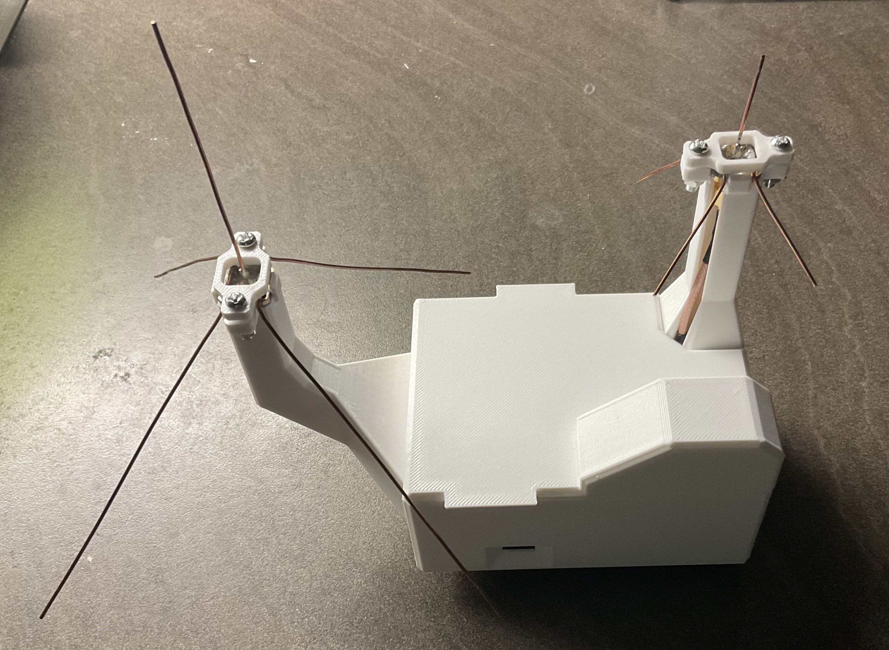

#### RF controller enclosure inside

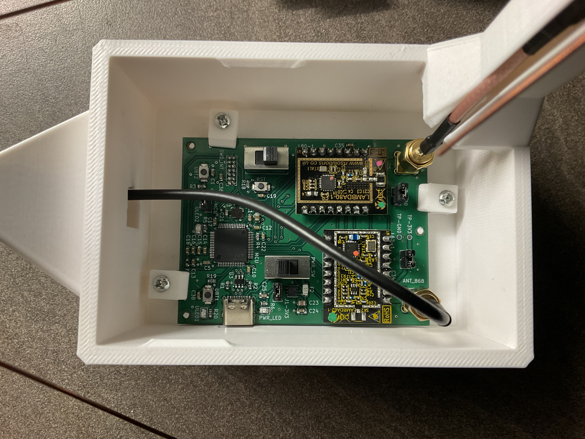

Alongside this I have started writing the firmware to drive the RF controller. I made a clean project and integrated HAL, TinyUSB for driving the USB connection, and FreeRTOS for concurrent task management. I plan to use this as an opportunity to learn FreeRTOS in a smaller project before attempting to implement it on the larger avionics board. So far I have got to the point where all the basic initialisation code is there and everything is integrated and seemingly working fine. Windows does detect a USB device is connected when I plug it in but the device descriptor cannot be obtained properly. I will attempt to fix this next and get the USB connection fully working.

---
### May 31st 2026

The RF controller PCB and components finally arrived and I assembled the board using the same method as the avionics board (hotplate reflow for the SMD parts and soldering iron for the remaining through hold components). Assembly went perfectly except for some easily fixed solder bridging on the MCU pins and one of the pads of the 16MHz crystal not soldering correctly. After assembly I brought up the board in stages using the power isolation jumpers and observed no issues. A stable 3V3 was output onto the power rail, the power LED turned on, and no components significantly heated up. The MCU was detected by STLINK and was able to be programmed, and I used cubeMX to generate a simple project that sent a message continuously over USB to a virtual COM port on the connected PC. Using this I was able to detect the device when it was plugged in and read the sent messages perfectly!

The next step is to design and print an enclosure to contain the board and antennas in one easy to transport package that also protects sensitive electronics from the elements.

#### RF controller bare PCB on the hotplate

#### RF controller fully assembled PCB

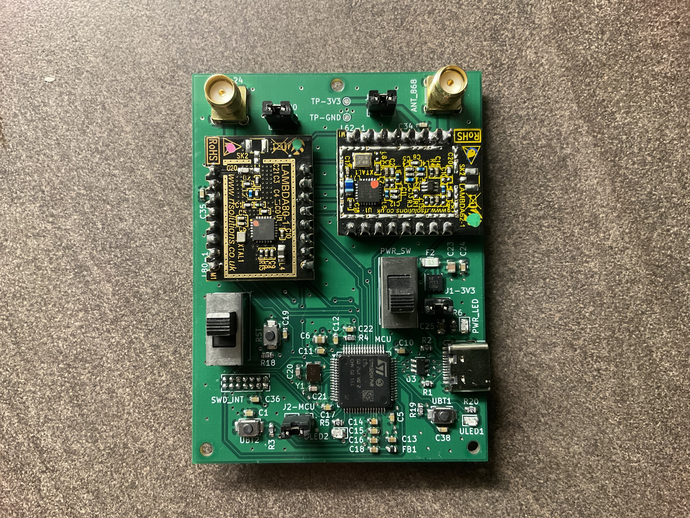

---
### May 14th 2026

The layout for the RF controller PCB has been finalised and ordered. Once it arrives I'll begin assembling and testing it, and then I can use it for testing the main avionics board command link. As mentioned earlier, this PCB is essentially a stripped down version of the avionics PCB with only the MCU and LoRa transceivers.

#### RF controller PCB schematics (microcontroller section)

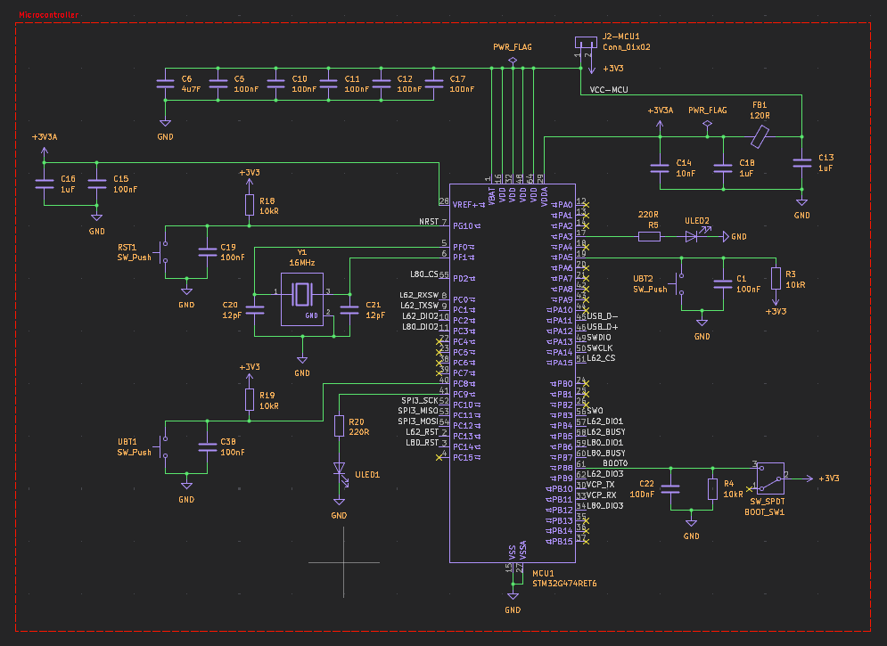

#### RF controller PCB schematics (transceiver and SWD section)

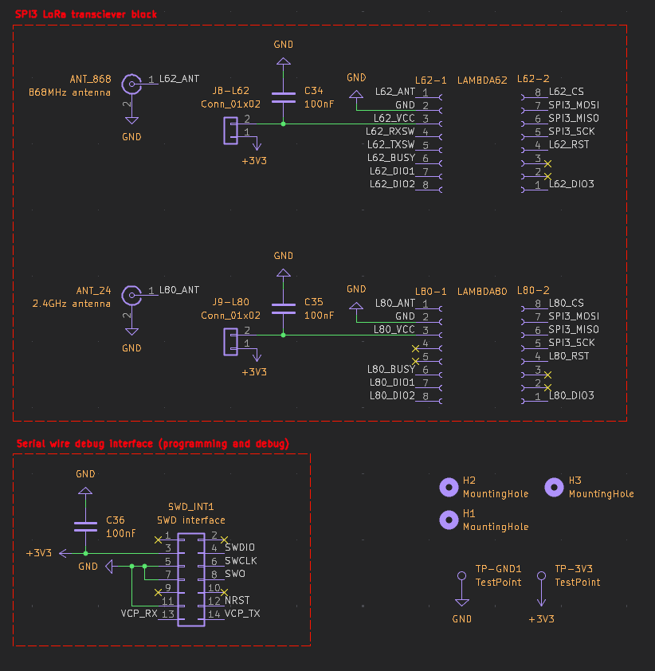

#### RF controller PCB schematics (USB and power section)

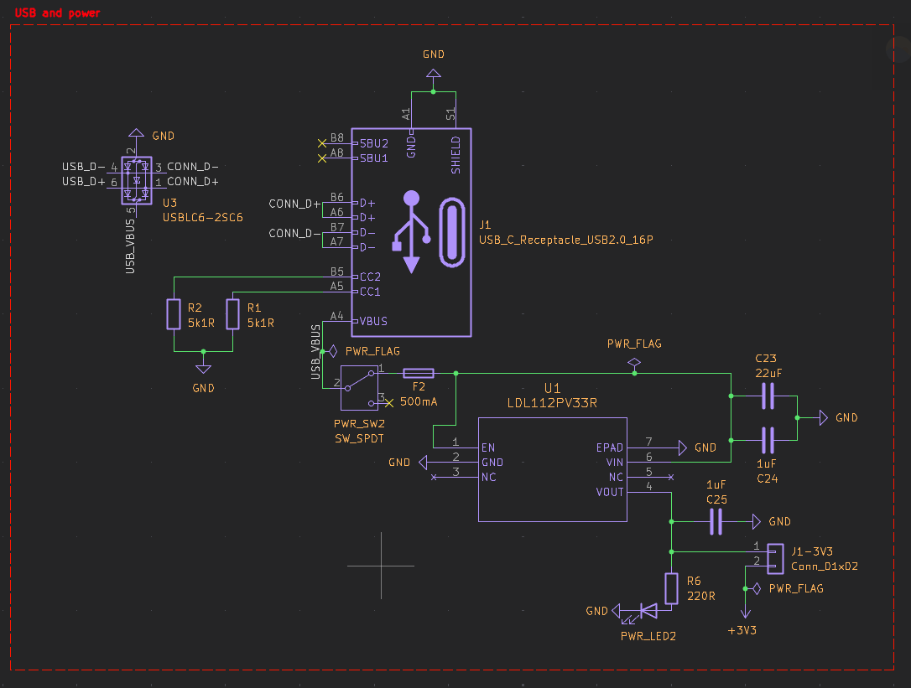

#### Finalised RF controller PCB layout (top and bottom signal layers in red and blue)

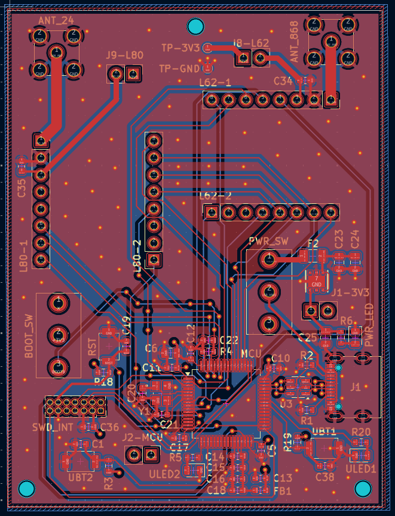

---
### May 12th 2026

I have been thinking about how I want to handle the command link and I have written up a plan [here](dev_board_planning/Command%20link%20plan.txt). In short, I plan to use a master-slave relationship where the central controller (eventually to be connected to the ground station computer) always initiates transactions which the other nodes in the network can respond to. I have expanded the plan to take into account the possibility of multiple slave nodes rather than just the single rocket avionics unit due to the fact that I have been exploring the idea of using a network of 3 SX1280 modules to triangulate the position of the rocket. This would replace the current plan to use phase difference of arrival to track the azimuth of the rocket and allow for a more accurate external determination of the rockets position to complement the on board sensors. However, it does require more setup and a more comprehensive network architecture to handle potential collisions. I am leaning towards doing this though as it would be nicer to be able to externally track the rocket in all 3 axes.

I have started designing a smaller PCB for the controller node which just contains an STM32G474RET6 MCU and the LAMBDA80 and LAMBDA62 transceivers. It also includes a USB connection to enable communication with the host PC. This version of the controller is just for testing as it does not include all the features that the full ground station PCB will need to have to control the motors, it's just much nicer to work with a neat PCB rather than breadboards, especially for this project where it will likely be a good while yet until I progress to making the full ground station PCB. So far I have made the schematic for the board and I will do the layout and routing next. It will be very similar to the main avionics board but just omitting all the sensors, storage, and parachute deployment sections. It also includes a USB-C connector from which is draws it's power. Power is stepped down to 3V3 by an LDL112PV33R LDO regulator instead of a buck converter for simplicity and less potential EMI from a switching power supply. I designed the main avionics board with a buck converter for efficiency reasons since it is battery powered rather than USB, but I may end up eventually switching that to an LDO as well in the final design as efficiency is not the main concern for short flights.

---
### May 6th 2026

I have finished implementing a small testing script which decodes the raw data transmitted from the avionics unit. The script reads a binary file of concatenated data packets and first parses the packet headers and contents to identify any missing packets by checking the sequence number. It then concatenates all the actual data contents of the packets and splits it into chunks by the sync word. Each chunk is checked to ensure it's reported and actual length match and the CRC is correct. Finally, for each validated chunk the data within is parsed and added to arrays containing the data and timestamps for each sensor reading.

Initially using this script I saw there were no data packets from the LSM6DSR or MAX-M10S modules after decoding the received binary. Using a hex viewer I saw there were GPS data packets in the raw binary, but they were not being parsed correctly. I eventually discovered that the missing MAX-M10S packets were due to the type bits in the data header being set wrong, making the decoding script think they were part of the magnetometer readings. However, there were no LSM6DSR packets at all. I did some debugging and found that the data ready interrupt was no longer firing even though it worked previously and I had not touched the driver code apart from to log the data, which should have no effect. In the end I realised that the lack of interrupt firing was due to the LAMDBA62 modules DIO1 pin being mapped to the same pin number as the LSM6DSR INT pin, and although I did not set up an EXTI interrupt on the DIO1 pin, I had mistakenly set the GPIO mode as IT_RISING, which masks the other ports interrupts in the HAL initialisation function. Changing the mode to input solved the problem and I was able to log, transmit, and decode data from all sensors successfully.

During transmission there were a few dropped packets. There is still no mechanism for requesting resends of packets, but that is the next priority. To do this I plan to set up the command link on the 868MHz band next.

#### Plotted test data from 100s of the board sitting stationary

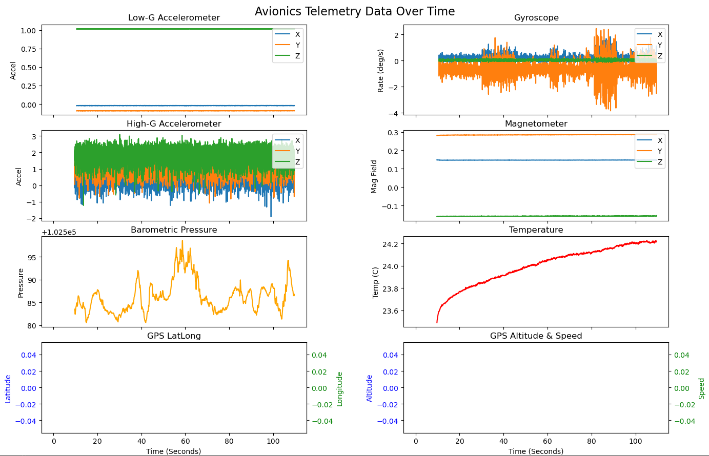

\* Note: GPS data is currently empty as this was done indoors

---
### May 3rd 2026

Over the past two days I have finished implementing and debugging data logging and a basic download link between the main avionics board and a host PC. Data logging has been more thoroughly tested now seems to work perfectly after ironing out a few issues. See the test logs [here](dev_board_planning/Data%20logging%20tests.txt) for more details.

I also spent a lot of time testing and debugging the data transmission function. I made two 2.4GHz ground plane monopole antennas in the same design as the previous 868MHz ones and connected them to the transmitter (avionics unit) and the receiver (nucleo-g431kb board connected to the host PC). Unfortunately, as I only have the nanoVNA-H which only measures up to 1.5GHz, I cannot tune the antennas perfectly for 2.4GHz so I just cut them to as close to the theoretical perfect length as possible.

#### 2.4GHz ground plane monopole antenna

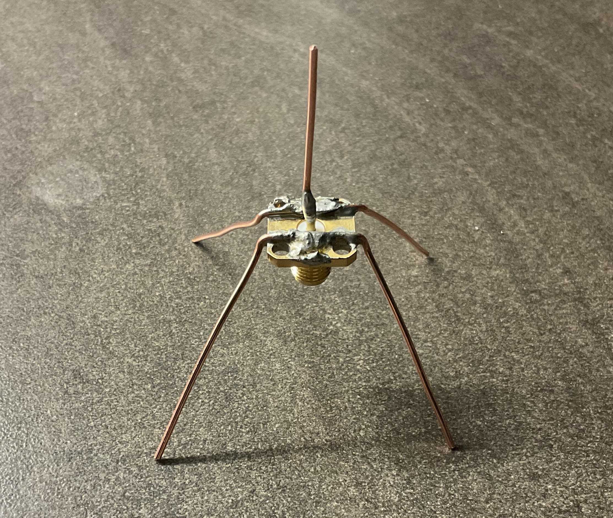

#### View of the fully assembled avionics unit with the 2.4GHz antenna and ST-Link attached

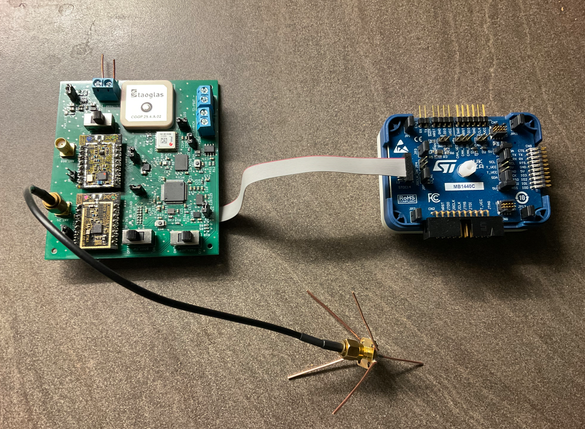

Initially the receiver was not receiving packets but it seems most of the issues were caused by some incorrect configuration options and not properly waiting for the transmitter to finish sending a packet before queueing the next one. After fixing the options, implementing proper delays, and adding a proper header and terminator to each packet we now have a working data download link which can transmit data to a host PC via a connected receiver over UART at around 200kb/s. There is currently no error correction in the download protocol though.

The next step is to properly decode and parse the raw binary data received and implement error correction in case of any missing or malformed packets.

---
### May 1st 2026

Today I finished the main functionality of both LAMBDA drivers and got most of the way through writing functions to enable data logging and transmission over 2.4GHz radio. There are two main bits of functionality added, the first being centered around the WriteFullDataPacket. This function writes all accumulated data from sensors to the flash memory periodically (currently at 10Hz controlled by TIM2). Data is accumulated in two identical buffers which operate in a 'ping-pong' fashion. Buffer A is filled initially with all data until the periodic write is triggered, at which point everything accumulated in buffer A is written to flash while all new data is accumulated in buffer B. On the next write the opposite happens, with buffer B being written to memory while data accumulation switches back to buffer A. While all functions are currently blocking for testing simplicity, in the future data collection will be among the highest priority tasks and so may take place in the middle of a write. This method prevents new data being written into the buffer currently being committed to flash which could cause data loss. Data accumulation into the buffers is handled by 'AppendLogPacket' functions specific to each sensor, which handles packaging their data into byte arrays and appending them to the buffer.

The second main bit of functionality is the data transmission. There is no USB or UART connection on this board currently so I plan to use the LAMBDA80 module to transmit the stored data to a host PC over 2.4GHz radio. While this will take longer than a wired connection, using the highest data rate modulation settings makes the expected transfer times manageable, though wireless transmission is more error prone and so will require error correction mechanisms. I have currently implemented a very simple function which reads all flight data and transmits it half a page at a time in blocking mode. To facilitate this, I added counters for the number of bytes and packets contained in the data section of flash which are initialised and maintained by the driver. There is currently no packet checking for error correction and only the transmit side is implemented.

I also finally got the desoldering iron I ordered and was able to switch the LAMBDA modules into their correct places using it, meaning I can now begin testing the LAMBDA drivers. First though, I need to make some 2.4GHz antennas (likely a ground plane monopole design like the 868MHz ones) and make a receiver device that can pass the data to the host PC. I plan to do this using the stm32 nucleo-g431kb boards I got a while ago and some simple breadboard circuitry so that I can get it up and running ASAP.

---
### Apr 29th 2026

Over the past few days I've been working on integrating the two LoRa transceivers. I soldered the LAMBDA62 and LAMBDA80 modules to the board only to realise I accidentally placed them the wrong way around. Although they have the same general pin layout, the LAMBDA62 has an additional two lines for the RX and TX switch pins so to be fully operational without bodge wires I need to swap them back. I tried desoldering them with solder wick but I cannot get enough of the solder out the through holes to lift them off safely. I have ordered a desoldering pump to help with this.

In the mean time I've made a start on the software side writing basic drivers to test both modules, starting with the LAMBDA62. At the moment I have written functions to do all needed functions like transmitting packets, receiving packets, and emitting a constant wave. These are all written as simple blocking functions currently for ease of testing but later they will be modified to be real time compatable by using DMA for the large buffer SPI transfers and EXTI interrupts on the BUSY pin to replace the current blocking polling loops. EXTI interrupts will also be used for the DIO pins to notify the MCU on packet transmission/reception. Unfortunately, DIO1 for the SX1262 (LAMBDA62) is unavailable as an EXTI interrupt as the LSM6DSR uses pin 4 as it's data ready interrupt. I didn't realise at the time of designing the PCB that EXTI interrupts cannot share pin numbers despite being in different ports. However, for the intended purpouse of simply sending a constant wave, the SX1262 does not need this second interrupt line.

I am currently in the process of writing the LAMBDA80 driver, which will use mostly the same code as the LAMBDA62 driver, just adapted to the specifics of the SX1280 instead. Once I can desolder and swap the modules I will be able to test the drivers proerly, although I will need to make 2.4GHz antennas for the LAMBDA80 first.

---
### Apr 25th 2026

Today I added some more functions to test the W25Q NOR flash driver. Here is a summary of the tests.

As detailed in yesterdays log, the driver can correctly boot up, read the metadata and flight data sections, erase the old data, and write new data. It also correctly handles wear levelling by incrementing the metadata and flight data section addresses on each write cycle.

Next I tested the bad block scanning function. It was able to complete the scan successfully and found no bad blocks as expected from a lightly used NOR flash chip.

Since there are no actual bad blocks, I expanded the bad block test to inject a fake bad block flag for the block starting at address 0x20000 (the 3rd block) and test writing and reading back a ~200KB chunk of data. The test wipes the first 10 blocks of flash before starting (to avoid a lengthy full chip wipe) which removes the existing metadata and data sections and causes blank ones to be created. This yields a repeatable setup where the metadata sector spans addresses 0x10000 to 0x11000, the bad block spans 0x20000 to 0x30000, and the data section starts at 0x1000 (starting empty). The test then writes approximately 200KB of data which, if correctly written, should expand the data section to place it's end address at 0x3FF8B. When the test was executed this exact behaviour was observed, confirming the writes were handled correctly and skipped the metadata section and bad block. Next the data was read back, starting from address 0x1000 and reading a length of 200KB. The data readout showed the data was written perfectly, with byte order being preserved across skipped sections and across pages. An additional initialisation test performed directly after this test where the chip is booted and reads the metadata/data sections confirmed it was able to read this written data perfectly from a fresh boot as well. See the test logs [here](dev_board_planning/W25Q%20bad%20block%20test%20log.txt).

Finally, I tested the wraparound behaviour at the end of memory. For this I wrote a function which initialised an empty metadata and data section by wiping existing data and then moved the empty data section start and end addresses to the last sector address in memory (0x1FFF000). It then writes 25 pages of data and reads it back from the starting address. This first test confirmed both the write and read functions correctly handle wraparound behaviour at the end of memory, perfectly preserving bytes across the transition. I then modified the test to move the data section back 1 block and inject a fake bad block in the last block, to test whether it could handle skipping a section and wrapping around at the same time. This second test worked perfectly as well. The third and final test just involved moving the data section to the original last sector address, which is now inside the fake bad block. Again, this was handled perfectly, with data being immediately wrapped around and written to the start of memory. See the test logs [here](dev_board_planning/W25Q%20wraparound%20test%20log.txt).

These tests confirm my W25Q driver is working as expected and I can now move on to the next steps, which I think will be adding in the final pieces of the board, the LoRa transceivers, to enable a command link and transfer of data.

---
### Apr 24th 2026

Finished implementing the rest of the functions needed for the NOR flash driver. These include:
- Read volume functions to read blocks of data in pages. The safe version also respects bad blocks and metadata sections and wraps the address if it extends beyond the end of memory.
- Split the safe address functions into 3 more specialised and robust functions which handle write addresses, full read addresses, and offset read addresses (for skipping around the data section only reading headers).
- Erase functions to erase either the full chip or specific blocks or sectors.
- Function which erases previously written flight data and automatically increments the data section start address and updates the metadata section.
- Function which detects and records bad blocks by writing a specific pattern to each page of memory and checking for readback errors.

I also wrote a small test function to check the W25Q is working correctly. It checks initialisation, erasing data, writing a test packet, and appending to already written data with another test packet. The first test using this function seemed to work perfectly, with all tests passing, however, when relaunching the debug session to check for correct incrementing of metadata and data addresses I encountered unexpected behaviours. At first every test after the first completely failed as the metadata section could not be found. Stepping through debug mode revealed the rx buffer was reading all zeroes on each block start address. The cause of this was eventually identified to be likely because of the erase sector and erase block functions not working correctly. Only the command was being sent, omitting the address to erase which would cause the command to be dropped or potentially cause other strange behaviour. After fixing this the data was able to be read normally.

The tests passed on each restart of the debug session now but the address incrementing was abnormal. Based on the data logging architecture we would expect the metadata address to increment by 1 block length each cycle and the data address to increment by 1 sector each cycle, except for the first cycle after a full erasure (as the empty data section would cancel the call to EraseFlightData and prevent address incrementing). In this case though, the first test after a full erase was normal, the second test showed the metadata and data start addresses did not change from the first test, and the third and fourth tests showed each address incremented twice the expected amount. Eventually I realised this was due to the slight delay in restarting a debug session allowing the MCU to boot and start executing code independently of the debug session. This caused the erase code to run at the start of the second test, meaning the addresses did not increment as expected. Then in the third and fourth tests the initialisation cycle was completed twice, once befor the debug sessions started and once after, causing the double increment. This has been temporarily dealt with by adding a 2s delay at the start of the main loop to prevent code from executing in the window between debug sessions. After adding the delay the addresses increment as normal and all tests pass perfectly.

The next priority is to test the bad block management and writing longer volumes which span multiple pages and stretch across block and memory boundaries.

---
### Apr 22nd 2026

Started developing driver firmware for data logging on the NOR flash chip (W25Q256JVEIQ). The data logging architecture plan can be seen [here](dev_board_planning/Data%20logging%20architecture.txt) which implements wear levelling and bad block management while clearing the way for fast data logging during flight where performance is critical. So far I have been working mainly on the startup sequence, gathering metadata and preparing functions for writing data safely.

Functions implemented:
- Initialisation function which resets the device, checks it is responding correctly, and sets it to 4 byte addressing mode for future commands.
- Get safe address functions. Perform checks to ensure all data is only written to a valid address (i.e. within memory bounds, not in bad blocks, (for non-metadata) not in the metadata or data sections).
- Read metadata function. Automatically scans the entire address space to find any existing metadata sectors. If found then it parses the information contained within to find the start address of the data section as well as any saved bad blocks. If not found then it automatically creates a blank metadata section at the beginning of memory.
- Write metadata function. Finds the first valid metadata sector address and writes current metadata to that sector. Optionally erases the previous metadata sector first.
- Write volume and page program functions. Work together to enable safe writing of large contiguous blocks of data only to safe addresses. Performs checks and automatically skips bad blocks and already written sections. Also splits the input data into chunks to fit within each page boundary safely.

To be implemented next:
- Functions to read volumes of data
- Functions to erase sections or the entire chip
- Function to scan for bad blocks
- Reconfigure initialisation sequence to properly use the above functions according to the [data logging plan](dev_board_planning/Data%20logging%20architecture.txt) (currently it just issues some basic commands)
- Implement planned read and write modes

 

---
### Apr 19th 2026

The 3rd board utilising the new V2 design was brought up successfully! Every important line was tested for shorts with a multimeter prior to closing the power isolation jumpers to each section one by one, all of which powered on successfully. The only section not brought up was the magnetometer/barometer section which contained a short between power and ground due to bridging under the MMC5983MA. Due to the lack of a working hot air gun firmware development was started with this section disconnected for a couple of weeks.

#### Firmware development pt.1
Initial tests using STM32CubeIDE with basic startup code showed the MCU was working perfectly and could interface with the peripheral devices like the user LED and accelerometers. The HAL library is used for functions like I2C and SPI communication to handle them robustly and get the board up and running quickly. Currently all communications operate in blocking mode for testing but this will be changed to use non-blocking DMA when moving to an RTOS architecture.

I started by writing drivers to handle the LSM6DSR and ADXL375 accelerometers, both on SPI bus 1. Both are set to sample measurements at 100Hz and send interrupts when their FIFO buffers contain a configurable number of measurements (currently 4). These trigger EXTI interrupts which set a 'data ready' flag and cause the MCU to initiate reading from the FIFO in the next loop. Data from the FIFO is read and the raw bits are converted into readable measurements and stored in buffers which are overwritten each time a new set of measurements comes in.

Before I could develop drivers for the other sensors (GPS, barometer, magnetometer) I had to fix the solder bridging under the MMC as it not only created a dangerous short between power and ground, meaning I couldn't power the magnetometer and barometer, but it also shorted the I2C bus SDA and SCL lines, meaning the GPS on the same bus could not be used.

#### Repairing the MMC
Eventually I got my hot air gun working again and attempted to repair the MMC. I tried applying some flux paste and reflowing with the hot air gun without lifting the chip off first but after a while of heating this did not resolve the bridges. I then tried removing the chip, wicking the pads on the PCB and chip flat, applying a small layer of solder on the PCB pads, and then reflowing the solder with flux while the chip sat on top. This did resolve the bridges and solder the chip properly but the MMC was unresponsive to an I2C scanner or direct I2C communication attempts. I now realise this is likely due to the extreme heat applied to it by prolongued hot air gun heating and wicking the pads with a soldering iron. A second attempt to transplant the MMC from the first PCB attempt (to which power was never applied) also ended identically. The chip soldered well but failed to respond likely again due to extended hot air exposure at temperatures too high. I attempted to solder a third fresh MMC to the board, this time trying to be more cautious with hot air exposure, but it also ended the same way.

It was at this point I realised that too much heat exposure must be the issue. The PCB schematic looked good after triple checking it and the soldering seemed to be working ok, not causing any bridges and soldering the pads properly (checked by testing the input diodes on the pins). I performed a series of thermal tests to identify the most conservative possible hot air conditions I could use to solder the chip from the underside of the PCB to avoid direct hot air exposure (see [thermal tests](../hardware/avionics/avionics_dev_board/Hot%20air%20tests.md)), and switched to using leaded solder to reduce the melting temperature needed. After soldering another fresh MMC using the newly identified more conservative conditions and verifying no shorts were present the board was powered on and the MMC responded to I2C calls! Subsequent software testing revealed that the SET/RESET function of the MMC does not seem to be working so more testing needs to be done to figure out why. The CAP pad may not have soldered correctly for example. This is non essential for the function of the MMC though as a different and more robust reading calibration method will eventually be implemented.

#### Firmware development pt.2
After successful repair of the MMC I was able to develop drivers for all remaining sensors, all of which use the same I2C bus as they are all slower sensors operating at 10Hz. Apart from the MMC SET/RESET issues mentioned above driver development for all these sensors went very smoothly and they all seem to work just fine. I have not been able to fully test the GPS module yet however as testing the board indoors prevents it from acquiring a satellite lock. It does output valid empty NMEA sentences however, so it seems to be working. To fully test it I will need to implement data logging and take it outside.

#### Data logging
Currently I am working on writing a driver for the NOR flash chip to enable data logging and readback. I have implemented a startup function and am currently trying to figure out a good structure to store the data efficiently and robustly. Below is my current plan for storing the data:

Buffers fill up with raw data that has been collected since the last write. Data is logged at 10Hz, at which point whatever is in the buffers is concatenated into a 'packet' that is sent to be written to storage. Each packet has a packet header with a sync word and information about the contents of the packet, followed by each piece of data which have their own headers containing information on the size and type of data they represent.

**Packet structure:**
\>> 4 Byte start sync word (AABBBBAA)
\>> 4 byte header: Total number of readings in packet [31:24], Total number of bytes in packet [23:8], Checksum [7:0]
[[[
\>> 2 byte header: Data type [15:12], Total number of bytes in data [11:0]
\>> Raw data (variable length)
]]] x N

### Note on updates going forward
From now on I am going to try and write these updates more informally and more fequently, almost for every day I work on something ideally. This will mean the updates will be smaller but overall contain much more detail as I will be able to accurately describe everything I've done and the decisions made, which become more difficult to remember after a while. It also reduces the friction to writing these updates which has been a problem. I hope that writing more frequent updates will also serve as a better look into the process, rather than just the results, of this project which I (and hopefully others) can look back on later.

---

### Apr 1st 2026

Further testing of the second avionics dev board ultimately seemed to suggest the board had some sort of catastrophic failure which has now left it unrepairable. Thermal imaging while powering the board bypassing the buck converter using a current limited benchtop power supply set at 500mA showed uniform heating across multiple components (the MCU, GPS module, accelerometers etc.). The amount of heating rose proportionally with the current limit set on the power supply.

#### Thermal imaging of the avionics dev board over time

Additionally, attempts to find any dead shorts by measuring the voltage drop between GND and various points around the board gave uniform readings for every point tested. Due to the lack of power isolation mechanisms on the board it was not possible to disconnect sections of the board to test individually, however, after desoldering the inductor in the voltage regulator section to isolate the buck converter from the rest of the board I was able to measure dead shorts on both sides. These tests point towards the chips on the board having been damaged by an overvoltage event during the initial power up, potentially caused by a poorly soldered or dysfunctional buck converter outputting too much voltage.

 

### Avionics dev board V2

To prevent the next board facing the same fate I decided to redesign some parts of the board to improve the bring up phase and testability, as well as adding some extral QoL things. The second version of the avionics dev board includes the following changes from V1:

- Changed SWD interface pins to STDC14 form factor
- Added a user LED and button to the free MCU pins
- Added solid ground and power test points in the middle of the board
- Add jumpers to isolate power to the main power rail and to individual sections of the board
- Switched to using smaller buttons to save space
- Increased distance between headers for the LAMBDA modules as they use non-standard spacing
- Switched to a lower 500mA but slower blowing fuse to prevent potential issues with inrush current
- Rearranged the fuse to be the first component after the power switch
- Decreased resistor values on LEDs from 1kR to 220R

#### Full board view (red = top signal layer, blue = bottom signal layer)

The new PCB design and fresh components were ordered and I have begun assembling the board. I am only assembling components as and when they are required this time to prevent any unneccesary damage if something goes wrong again. So far, all SMD components were soldered via hotplate reflow as before, and the main power terminal, power isolation jumpers, and switches were soldered manually. Extra care was taken to not apply too much solder paste as this may have caused the issues seen in the second attempt of V1. A few minor bridges between MCU and buck converter pins were resolved after reflow though there is still some potential bridging under the MMC magnetometer module which is difficult to assess with my current tools. I have ordered some smaller multimeter test probes to enable easier measurements of lines connecting to the MMC module to help diagnose any potential issues before bringing up the board completely.

Before the potential MMC bridging is resolved though I tested the power regulator section of the board by disconnecting all power isolation jumpers, ensuring the regulator did not connect at all to the rest of the board. First I probed all the pins of the buck converter to ensure there were no shorts and they were connected properly. I also tested a few other parts for shorts and checked diode orientation and fuse continuity. All of these tests passed. Then for an initial test to ensure the buck converter worked safely I used a benchtop power supply to supply 9V at a low current limit of 35mA. When this power was supplied, the buck converter output a stable 3.3V and thermal imaging confirmed no components were heating up substantially.

I next plan to use the multimeter to thoroughly test and resolve any issues with the rest of the board before bringing up each section individually.

---

### Mar 10th 2026

The PCB and components arrived and I was able to assemble the PCB using hotplate reflow. The first attempt went well except for a misaligned MCU which meant each pin in one axis was offset by 1. I tried to correct this by using a hot air station to move the MCU but it seemed to be not heating it well enough to melt the solder. I now know I should have used the hot air station while the board was soaking in 150C heat on the hotplate. Instead I tried using a soldering iron to melt the solder and move the MCU but this resulted in many of the pins being bent beyond repair.

Luckily I had bought two sets of every component for exactly this scenario so I attempted it again the next day. This time making sure the MCU and all other components were more precisely aligned. After reflow all components appeared to be correctly aligned and a few minor bridges between MCU and sensor pins were corrected using the soldering iron. Through hole components were added on to complete the board.

After assembly the board was tested with a fresh 9V battery. Upon flipping the power switch on I saw what looked like a brief flash of light in the voltage regulator area and no light from the power LED. Testing with a multimeter revealed the 1A fuse just before the buck regulator had blown and further testing revealed a short circuit is present between ground and power somewhere on the board. In order to locate the short circuit I have ordered a benchtop power supply and thermal camera to pump a limited current into the circuit and observe hotspots.

#### Assembled dev board in it's current state

---

### Feb 28th 2026

While waiting for components to arrive I've been learning about the general STM32 MCU startup process and writing some very simple bare metal startup code for the STM32G431KB MCU. This is able to be flashed onto the STM32G431KB-NUCLEO board and the loop counter can be seen increasing using GDB and OpenOCD.

---

### Feb 12th 2026

First design interation of the avionics development PCB has been completed. The PCB and components have been ordered and I will begin assembly and testing when they arrive.

#### Full board view (red = top signal layer, blue = bottom signal layer)

The board is organised roughly into 5 sections:
- Top right: Power supply and voltage regulator. Power is supplied by a 9V battery across the J1 terminal and stepped down to 3V3 by a TPS563201 buck converter.
- Top middle/left: LoRa transceivers and antenna SMA connections.
- Middle right: GPS module and antenna.
- Bottom right: Parachute deployment system. Utilises a separate power supply driven by a MOSFET to burn a length of nichrome wire.
- Bottom left: Main MCU and sensor block.

This board uses a 4 layer stackup of SIG-GND-PWR-SIG, enabling easy distribution of power throughout the board. To minimise return path issues, only not critical signals are routed on the bottom signal layer with the power layer as it's reference. The only signal this was not possible for is the GPS antenna line, for which a separate island was made on the power layer surrounding the trace tightly coupled to ground using many vias. Along with this, 4 vias were placed to surround the signal via when it transitions back up to the top layer to ensure it always maintains a close ground reference.

#### GPS antenna trace shielding

0602 footprints were used for most passives except large value capacitors. I plan to assemble the board using a stencil to apply solder paste and a hot plate to reflow. Through hole components can then be soldered manually afterwards.

---

### Feb 1st 2026

The issue causing miscounting of packet sequence numbers by the receiver in the LAMBDA62 rangetest setup has been identified and fixed. Testing confirmed this was caused by the transmitter repeatedly resetting and starting the transmission counter from 0 again. The 9V battery powering the transmitter was outputting a much lower voltage than expected (around 7V, while the receiver battery output almost 9V) so a fresh battery was used. This fixed the issue and transmission was able to continue uninterrupted while the receiver correctly counted each packet. To mitigate the chance of this issue happening in the field spare batteries will be brought.

Component selections for the avionics unit have been finalised. Changes from the previous selections are detailed below:

- MCU = STM32G474RET6; The chip will be used rather than a nucleo board for compactness and to reduce cost.
- Storage = W25Q256JVEIQ; NOR flash will be used instead of NAND flash to increase reliability for storing critical flight data. This still offers more than enough storage capacity to write flight data for multiple long launches if needed.
- IMU = LSM6DSR; Switched to the R variant for lower risk of gyro saturation for negligible increase in cost.
- Pressure/temp = BMP581; Mainly due to lack of availability of the BMP390, but also slightly increased sensitivity.
- Magnetometer = MMC5983MA; Highly improved performance with degaussing option to remove offsets caused by other nearby components.

---

### Jan 28th 2026

Started designing the development PCB for the avionics unit, beginning with the power source. This utilises a TPS563201 buck converter to provide a stable 3.3V DC source from a 4.5V-17V input. Component values were taken from the datasheet specifications with resistor R2 being 33kΩ to get a 3.3V output. A space for capacitor C4 was added despite likely being unneeded so that the pads are there for easy addition later if testing shows it is needed. A switch was also added between the positive terminal input and the TPS563201 enable pin to allow the power source to be easily switched on and off. Temporary footprints have been used for the moment until actual component models are decided.

#### Schematic view

#### PCB view

#### 3D view

---

### Dec 2025 - Jan 2026

This is a summary of the progress made in the first couple months of the project before I started taking logging more seriously.

I started the project by making prototype breadboard circuits to test communication between two LAMBDA62 modules, which contain the SX1262 868MHz transceivers used for this project. Arduino nanos were used to drive the transceivers through TXS0108E bidirectional logic level shifters to match the 5V Arduino logic to the 3.3V logic of the LAMBDA62 module. See the below [wiring schematic](../hardware/prototyping/LAMBDA62_rangetest/RangeTest.kicad_sch) and photo of the assembled rig.

#### Wiring schematic

#### Assembled test rig

The antenna was an 868MHz ground plane monopole made from 1mm diameter bare copper wire soldered onto a SMA female panel mount connector. The monopole was originally cut to be 90mm long while the radials were cut to extend 100mm from the edge of the panel mount. A nanoVNA was used to tune the antenna by cutting the monopole until the point of minimum SWR was close to 868MHz. The final antenna and nanoVNA test results are shown below.

#### Final antenna

#### NanoVNA test results

 

A simple lightweight Arduino sketch ([LAMBDA62_rangetest.ino](../firmware/prototyping/LAMBDA62_rangetest/LAMBDA62_rangetest.ino)) was made to drive the LAMBDA62 using only the SPI library. This sketch can be uploaded to the transmitter and receiver by changing the 'receiver' variable at the top. The transmitter will transmit the payload at the soonest avaiable opportunity with a 20ms delay in between packets and the receiver will receive each packet and determine whether it was sent correctly, along with measuring the strength of the signal. This information is output through the serial port of the Arduino to a connected computer running the [SerialMonitor.py](../firmware/prototyping/LAMBDA62_rangetest/SerialMonitor.py) script, which parses the information and outputs summary statistics every 50 packets to the command line and a text file while writing individual packet statistics to a .csv file.

A range test was conducted on a long flat beach using this setup. The transmitter was stationary on a plastic cutting board on the ground while the receiver was moved away as it received packets. The results can be found [here](./initial_range_tests/01-01-26_results/) graphs of the per packet RSSI/SNR over time and SNR vs RSSI are below. The results were much worse than expected as packets began being missed after only 200m of distance, and all reception was lost after ~600m. However, it is very likely this was caused by bad testing conditions. Placing the transmitter on the ground likely greatly reduced signal transmission efficiency due to ground proximity effects. The weather was very windy which meant the transmitter had to be touched for a significant portion of the test, likely also reducing the antennas radiation effectiveness due to body coupling. In addition, the receiver was moved by holding the breadboard it was attached to and letting it hang underneath held by the coax cable. Walking motions and the wind therefore cause significant polarisation mismatch as the receiver swung around. Another issue encountered during the test was the miscounting of packet sequence numbers by the receiver, causing the missed packet calculations to be significantly off. This issue was not observed during testing before the range test. The issue may have been caused by the receiver not correctly detecting packets with CRC errors, resulting in wrong data being decoded for the sequence number which then throws the calculations off. This was not tested before the first range test as I had no reliable way to induce CRC errors.

#### Per packet RSSI and SNR over time

#### Per packet SNR vs RSSI

Although noisy and less than ideal, the SNR vs RSSI relationship shows promise for the feasibility of using the AD8302 module with 20-30dB gain LNAs for PDOA tracking. The SNR does not begin appreciably dropping until an RSSI of around -90dBm, which shows the 868MHz signal is still received significantly above the noise floor in the RSSI range of the AD8302 (-60dBm) + 20-30dB LNA (-90dBm). Therefore it should be able to reliably process the CW tone uncomplicated by noise until its strength falls out of range.

To ensure the next range test provides more useful results the following modifications will be made:
- Fix the packet sequence number bug which is potentially caused by incorrect handling of erroneous packets. Test this by inducing corrupted packets, potentially by using an implicit/explicit header mismatch between the transmitter and receiver.
- Make a testing enclosure to protect and hold the components in place more rigidly. This will help protect the electronics from outside conditions and hold the antenna in place on an insulating material to ensure a better polarisation match. Additionally, they can be held high off the ground using handle underneath to reduce ground and body coupling effects.

The testing enclosure has been modeled and 3D printed with PETG (see model files [here](../mechanical/simple_range_test/) and images below).

#### Range test enclosure (closed - handle on the left screws into the base)

#### Range test enclosure (open)

