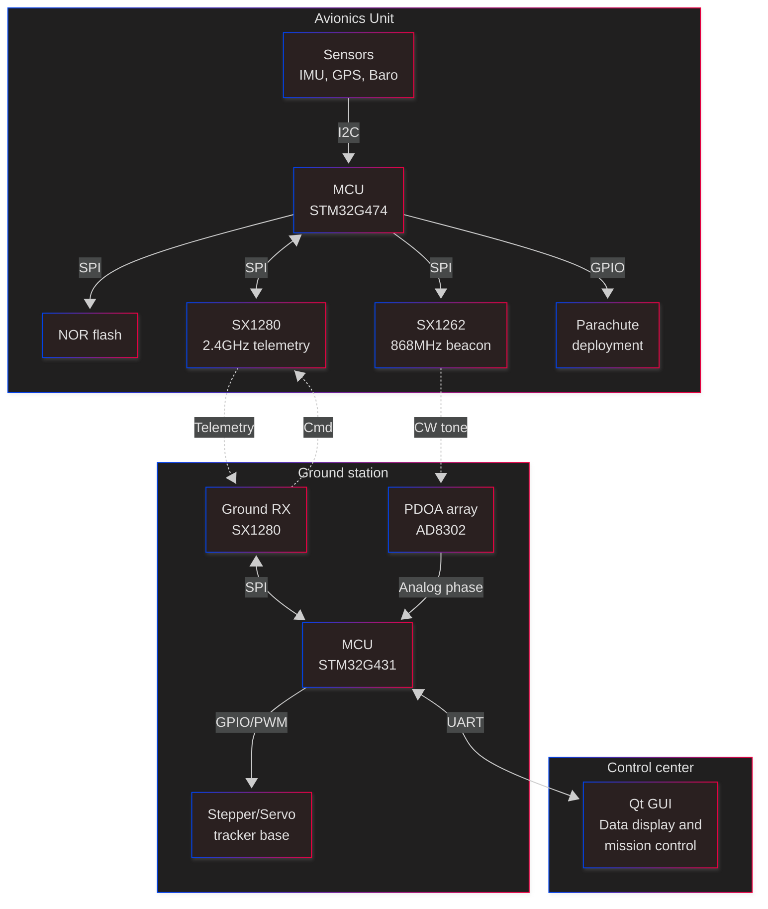
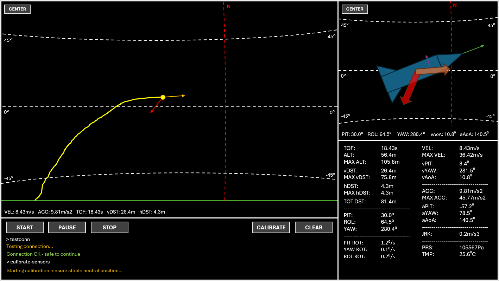

# **Avionics project plan**

Overall plan for the project and a rough order for the development timeline. Updated 24/01/26.

## **Project overview**

Sensors on a model rocket collect readings and a microcontroller integrates them in real time to calculate stats like position and velocity. The full dataset is written to non-volatile storage and a subset of important info is transmitted over the air to a ground station.

The ground station uses the received position and velocity data to calculate the expected angle the antenna array needs to rotate to keep pointing at the rocket. The rocket also transmits periodic tones on a separate frequency which are received by two antennas arranged horizontally at either side of the main telemetry antenna and the phase difference between the two received signals is used to fine tune the azimuth angle of the rocket. These two methods allow the ground station to update the current position of the rocket and rotate the antennas to track it in real time.

The ground station receives the main telemetry data via a high gain central antenna and decodes and passes this info to the connected computer (the ‘control center’) which displays the info on a live updating GUI. This control center is also connected to the launch pad to initiate the launch, along with being able to control the ground station and rocket by issuing commands (e.g. to calibrate sensors before launch).

### **Onboard avionics**

The rocket will have an onboard avionics unit containing multiple sensors, transceivers, antennas, a parachute system, and a central MCU. Specific models below:

* MCU = STM32G474RET6

* NOR flash = W25Q256JVEIQ

* IMU = LSM6DSR

* High range accelerometer = ADXL375BCCZ

* Pressure/temperature sensor = BMP581

* Magnetometer = MMC5983MA

* GPS = MAX-M10S-00B

* 868MHz LoRa transceiver = SX1262 (LAMBDA62)

* 2.4GHz LoRa transceiver = SX1280 (LAMBDA80)

Two transceivers will be present on the rocket with their respective antennas – the SX1262 (868MHz, LAMBDA62 module), and the SX1280 (2.4GHz, LAMBDA80 module). The 868MHz band will be used to emit a pure sine wave tone for 20ms at 10Hz which will be used by the ground station to provide accurate azimuth tracking by PDOA. The 2.4GHz band will be used to transmit telemetry data at 10Hz. Transmitted data will include the rockets calculated position, velocity, acceleration, orientation, and temperature/pressure.

A central MCU (STM32G474RET6) will be used to control everything in the avionics unit. It will:

* Interface with the sensors and collect data from them.

* Write the raw data to a NOR flash chip (W25Q256JVEIQ) for later in-depth analysis.

* Integrate the raw data into accurate estimates of position (IMU, GPS), angle (IMU, magnetometer) etc.

* Interface with the two transceivers to send out tracking tones and telemetry data periodically.

* Activate the parachute deployment system when necessary.

FreeRTOS will be implemented to handle all these tasks concurrently.

 

### **Ground station**

The ground station will consist of a central 2.4GHz high gain antenna with two 868MHz antennas flanking horizontally spaced ½ a wavelength apart. Mechanical construction of the mount will have to be precise and strong to maintain this distance accurately. The 2.4GHz antenna will likely be either a Yagi with many elements or a dish. The design for the 868MHz antennas is undecided as of yet but likely would also benefit from a high gain design to improve sensitivity of PDOA measurements.

The antenna array will be mounted on a motorised base that allows it to point towards any location in the sky. Azimuth will be controlled by a stepper motor to allow 360-degree movement, while elevation will be controlled by a servo motor.

The 2.4GHz antenna is connected directly to the ground station MCU (STM32G431KBT6U) via a LAMBDA80 transceiver. The 868MHz antennas are both connected to 868MHz SAW filters followed by 20-30dB gain LNAs, then both LNA outputs are connected to an AD8302 module with its phase angle output connected the MCU. The MCU will use telemetry transmissions received on the 2.4GHz and measure phase differences on the 868MHz band so track the rocket as it moves. Rocket position data can be used to set expected azimuth and elevation angles while phase angle readings can be used to more precisely tune the azimuth angle. The MCU also passes all of this information on to the control center.

 

### **Control center**

The ground station MCU sends all information received from the rocket to the control center computer. This info is then processed and displayed on a live updating GUI (design concept below). The GUI will show many interesting stats about the flight which are updated live. Along with this, it will also have interactable 3D renderings of the path of the rocket and it’s current orientation and movement.

The GUI will also have a built in CLI which can be used to control various functions of the ground station and rocket by issuing commands. For example, to calibrate sensors before launch, to initiate the launch itself, to start/stop data recording etc.

 

### **Ideal outcome**

Once fully built the ideal flow of a launch from start to finish is as follows:

* Set up ground station, launchpad, and control center.

* Initiate connection between control center and ground station (wired), and ground station to rocket (radio - before launch the rocket transceivers can communicate bidirectionally with the ground station using a listen-before-talk approach to avoid collisions).

* Calibrate ground station and rocket sensors by issuing commands via control center CLI. These get sent to the ground station which transmits the commands to the rocket if that is the intended destination.

* Send command to the 

* Send command to set off rocket launch. Rocket starts telemetry transmission and switches to exclusively TX.

* Launch pad sets off motor and rocket launches.

* As the rocket enters steep ascent telemetry packets describing its position reach the ground station which moves the motorised base to keep the rocket in view of the directional antennas.

* Telemetry data is passed to the control center which processes the data and updates the GUI live to show stats and 3D renderings of the rocket.

* As the rocket continues flying it may get far enough away to cause the 868MHz signal to fall out of the useable range of the AD8302 module, at which point azimuth tracking based on phase angle data is disabled and position telemetry data is used exclusively. The point at which phase angle data becomes unreliable is determined by a threshold on the AD8302s signal strength output.

* If the ground station does not receive a valid telemetry packet at the expected interval it will update the expected position of the rocket by using the last correctly received position, velocity, and acceleration values. This will continue until another packet is received, at which point the new position overrides any calculated position up to that point.

* As rocket reaches its apex and begins descending the avionics unit deploys the onboard parachute.

* Rocket lands safely on the ground.

* Avionics unit detects landing and stops telemetry recording and transmission after a short delay.

* Rocket retrieved and full dataset can be downloaded from onboard storage.

 

## **Development timeline**

##### 1\. RF link validation and range tests

* [x] Model and 3D print antenna testing enclosures.
* [ ] Assemble SX1262 (LAMBDA62 module - 868MHz) and SX1280 (LAMBDA80 module - 2.4GHz) test rigs with 1/4 wave ground plane monopole antennas (driven by Arduinos while STM32s are on backorder) and perform range tests to validate feasibility and collect field data for RSSI and SNR at distance.

##### 2\. Avionics unit

* [ ] Design avionics unit development PCB with convenience features like line test pads, 0 ohm resistors etc. Transceivers are used as modules plugged into the PCB (later to be soldered permanently) while everything else is used as bare chips soldered directly to the PCB via hotplate reflow. Also include power management IC and safety arming switch for parachute deployment system.
* [ ] Acquire parts for avionics development PCB and assemble it.
* [ ] Write sensor drivers for STM32.
* [ ] Test sensor data acquisition and accuracy.
* [ ] Write NOR flash chip driver for STM32. Implement LittleFS.
* [ ] Test storage of sensor data on NOR flash.
* [ ] Implement FreeRTOS on the STM32.
* [ ] Implement task to write all collected sensor data to NOR flash chip without interrupting critical sensor reading tasks.
* [ ] Write SX1280 and SX1262 drivers for STM32.
* [ ] Implement and test periodic transmission of collected sensor data through the SX1280 (lowest priority).
* [ ] Implement and test sensor fusion and data integration algorithms to accurately track positional data over time.
* [ ] Implement and test parachute deployment logic.
* [ ] Switch periodic transmission to send integrated data and do final test of full system.

##### 3\. Motorised antenna base

* [ ] Build motorised portion of antenna base with stepper driving azimuth and servo driving elevation (no antenna mountings yet).
* [ ] Add STM32G431KB (with FreeRTOS) and write drivers for it to drive the motors.
* [ ] Implement and test algorithm to enable the STM32 to drive the base to point at any angle in the sky using PID controller.
* [ ] Upgrade algorithm to take a location and point at it by determining the relative angle.
* [ ] Build, test, and mount the 2.4GHz main telemetry antenna onto the base.
* [ ] Hook up antenna to SX1280 driven by the STM32 and test receiving of periodic telemetry transmissions from the avionics unit.
* [ ] Add calibration routine for the base to set it's initial offset from signal source.
* [ ] Test moving the antenna base to constantly point at the received location data (may be best done by mounting the avionics unit on a drone).

##### 4\. Adding PDOA tracking

* [ ] Build and test 868MHz antennas.
* [ ] Build small testing rig for the AD8302 module with SAW filters and LNA amplifiers.
* [ ] Test feasibility and accuracy of signal angle measurement using AD8302 horizontally and vertically.
* [ ] Add SX1262 (LAMBDA62) to the avionics unit and add task to transmit a beacon signal periodically.
* [ ] Mount 868MHz antennas horizontally flanking the main telemetry antenna on the base and hook up AD8302, filters, and amplifiers to STM32.
* [ ] Add calibration routine for PDOA signal.
* [ ] Test signal angle measurement using the full setup.
* [ ] Upgrade base tracking algorithm to use PDOA data in combination with the received location data.
* [ ] Test base tracking with both telemetry and beacon signal transmissions active simultaneously.
* [ ] Add 'failure' modes to the base tracking algorithm. Ignore PDOA signal if strength is too low and if neither signal is received fall back to following the predicted path of the rocket based on the last reliably received data.

##### 5\. Control center

* [ ] Implement task on antenna base STM32 to periodically send relevant data to control center computer via serial connection.
* [ ] Build basic control center GUI to display received data (simulated or real) in text.
* [ ] Test GUI with fake injected data and real field data.
* [ ] Implement bidirectional communication between ground station and avionics unit through 2.4GHz.
* [ ] Implement command line into GUI to issue commands to the antenna base through serial connection.
* [ ] Expand GUI to add in 3D graphics of rockets position and orientation.
* [ ] Test all systems with fake and live data.

##### 6\. Rocket

* [ ] Build and test model rocket with no avionics.
* [ ] Build and test model rocket with weights equivalent to avionics.
* [ ] Design compacted avionics unit PCB which integrates any changes and removes development features.
* [ ] Integrate avionics PCB into rocket.
* [ ] Integrate and test parachute deployment.
* [ ] Final tests of full system with fake and live data.
* [ ] Launch.
