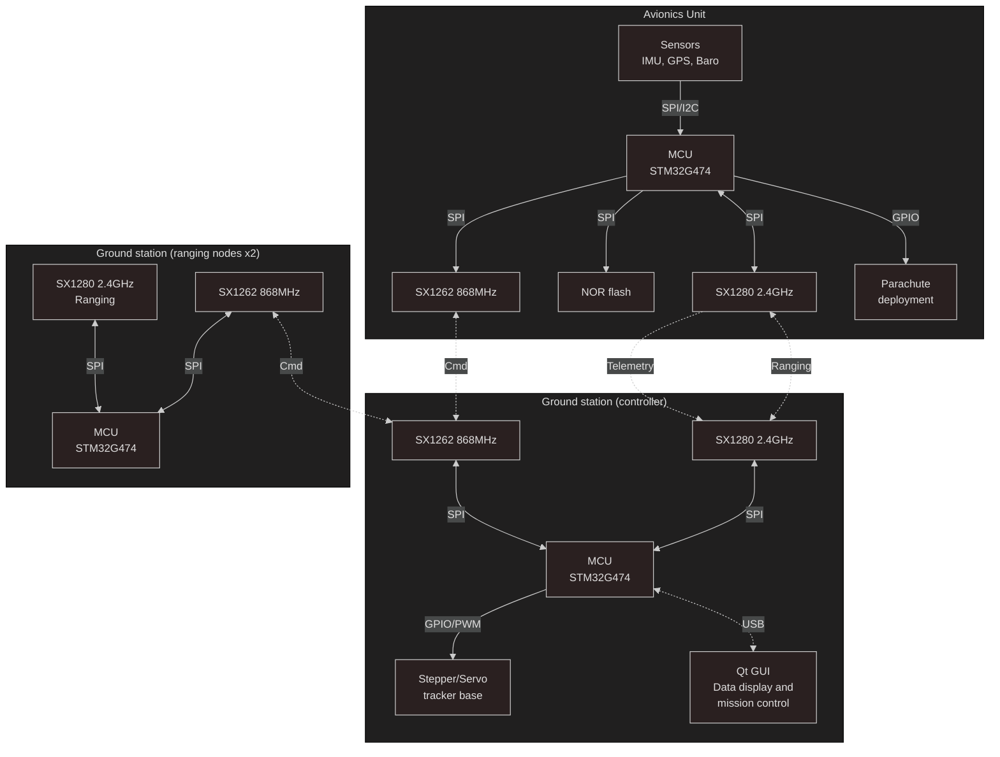
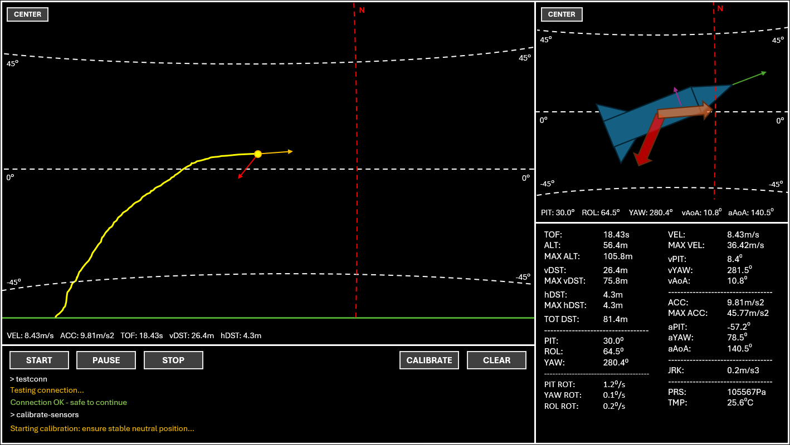

# **Avionics project plan**

Overall plan for the project and a rough order for the development timeline. Updated 01/07/26.

## **Project overview**

Sensors on a model rocket collect readings and a microcontroller integrates them in real time to calculate stats like position and velocity. The full dataset is written to non-volatile storage and a subset of important info is transmitted over the air to a ground station.

The ground station uses the received position and velocity data to calculate the expected angle the antenna array needs to rotate to keep pointing at the rocket. An array of 3 ground nodes will also periodically measure their distance to the rocket and transmit the results to the controlling node connected to a PC. These ranging results, along with known distances between each node, can be used to get a second measurement of the position of the rocket which is completely independent of the onboard sensors. These two methods allow the ground station to update the current position of the rocket and rotate the antennas to track it in real time.

The ground station receives the main telemetry data via a high gain central antenna and decodes and passes this info to the connected computer (the ‘control center’) which displays the info on a live updating GUI. This control center is also connected to the launch pad to initiate the launch, along with being able to control the ground station nodes and rocket by issuing commands (e.g. to calibrate sensors before launch). Each network node and the rocket has an 868MHz and 2.4GHz transceiver integrated. The 868MHz band is used to transmit commands while the 2.4GHz band is used for ranging and transmitting larger data streams.

```mermaid
---
config:
  theme: neo-dark
  layout: dagre
---
flowchart TB
 subgraph Rocket["Avionics Unit"]
        MCU_R["MCU<br>STM32G474"]
        Sensors["Sensors<br>IMU, GPS, Baro"]
        NOR["NOR flash"]
        RKT_24["SX1280 2.4GHz"]
        RKT_868["SX1262 868MHz"]
        Parachute["Parachute<br>deployment"]
  end
 subgraph Air["Ground station (controller)"]
        GS_24["SX1280 2.4GHz"]
        GS_PDOA@{ label: "<span style=\"padding-left:\">SX1262 868MHz</span>" }
        MCU_G@{ label: "MCU<span style=\"padding-left:\"><br>STM32G474</span>" }
        Motors["Stepper/Servo<br>tracker base"]
        GUI["Qt GUI<br>Data display and<br> mission control"]
  end
 subgraph s1["Ground station (ranging nodes x2)"]
        n1["SX1280 2.4GHz<br>Ranging"]
        n2@{ label: "<span style=\"padding-left:\">SX1262 868MHz</span>" }
        n3@{ label: "MCU<span style=\"padding-left:\"><br>STM32G474</span>" }
  end
    Sensors -- SPI/I2C --> MCU_R
    MCU_R -- SPI --> RKT_868 & NOR
    MCU_R <-- SPI --> RKT_24
    MCU_R -- GPIO --> Parachute
    RKT_24 -. Telemetry .-> GS_24
    RKT_868 <-. Cmd .-> GS_PDOA
    GS_24 <-- SPI --> MCU_G
    GS_PDOA <-- SPI --> MCU_G
    MCU_G -- GPIO/PWM --> Motors
    MCU_G <-. USB .-> GUI
    GS_24 <-. Ranging .-> RKT_24
    n1 <-- SPI --> n3
    n2 <-- SPI --> n3
    n2 <-. Cmd .-> GS_PDOA

    GS_PDOA@{ shape: rect}
    MCU_G@{ shape: rect}
    n1@{ shape: rect}
    n2@{ shape: rect}
    n3@{ shape: rect}
```

### **Onboard avionics**

The rocket will have an onboard avionics unit containing multiple sensors, transceivers, antennas, a parachute system, and a central MCU. Specific models below:

* MCU = STM32G474RET6

* NOR flash = W25Q256JVEIQ

* IMU = LSM6DSR

* High range accelerometer = ADXL375BCCZ

* Pressure/temperature sensor = BMP581

* Magnetometer = MMC5983MA

* GPS = MAX-M10S-00B

* 868MHz LoRa transceiver = SX1262 (LAMBDA62)

* 2.4GHz LoRa transceiver = SX1280 (LAMBDA80)

Two transceivers will be present on the rocket with their respective antennas – the SX1262 (868MHz, LAMBDA62 module), and the SX1280 (2.4GHz, LAMBDA80 module). The 868MHz band will be used to receive commands from the controlling ground station node and send back responses. The 2.4GHz band will be used to transmit telemetry data at 10Hz, as well as range with the network nodes. Transmitted data will include the rockets calculated position, velocity, acceleration, orientation, and temperature/pressure.

A central MCU (STM32G474RET6) will be used to control everything in the avionics unit. It will:

* Interface with the sensors and collect data from them.

* Write the raw data to a NOR flash chip (W25Q256JVEIQ) for later in-depth analysis.

* Integrate the raw data into accurate estimates of position (IMU, GPS), angle (IMU, magnetometer) etc.

* Interface with the two transceivers to process commands and send out telemetry data periodically.

* Activate the parachute deployment system when necessary.

FreeRTOS will be implemented to handle all these tasks concurrently.

 

### **Ground station**

The ground station is made up of a network of 3 nodes, two ranging nodes and a main controlling node. The controlling node is connected to the control center PC via USB and will use a central 2.4GHz high gain directional antenna and an omnidirectional 868MHz antenna. The 2.4GHz antenna will likely be either a Yagi with many elements or a dish, while the 868MHz antenna will likely be a sleeve dipole. The 2.4GHz antenna will be mounted on a motorised base that allows it to point towards any location in the sky. Azimuth will be controlled by a stepper motor to allow 360-degree movement, while elevation will be controlled by a servo motor. The MCU will use telemetry transmissions received on 2.4GHz and ranging information received on 868MHz to track the rocket as it moves. The MCU also passes all of this information on to the control center.

The ranging nodes are simpler and will use omnidirectional 2.4GHz and 868MHz antennas. They will be placed at least a few hundred meters apart and form a triangle around the launch pad with the controlling node. These are used purely to range the rocket to provide a second position measurement and are controlled by the controlling node sending commands over 868MHz.

 

### **Control center**

The controlling node MCU sends all information received from the rocket to the control center computer. This info is then processed and displayed on a live updating GUI (design concept below). The GUI will show many interesting stats about the flight which are updated live. Along with this, it will also have interactable 3D renderings of the path of the rocket and it’s current orientation and movement.

The GUI will also have a built in CLI which can be used to control various functions of the ground station and rocket by issuing commands. For example, to calibrate sensors before launch, to initiate the launch itself, to start/stop data recording etc.

 

### **Ideal outcome**

Once fully built the ideal flow of a launch from start to finish is as follows:

* Set up ground station, launchpad, and control center.

* Initiate connection between control center and ground station controlling node (wired), and controlling node to rocket and ranging nodes (radio).

* Calibrate ground station and rocket sensors by issuing commands via control center CLI. These get sent to the controlling node which transmits the commands to the relevant node.

* Send command to set off rocket launch. Rocket starts telemetry transmission and periodic ranging on 2.4GHz.

* Launch pad sets off motor and rocket launches.

* As the rocket enters steep ascent telemetry packets describing its position reach the ground station which moves the motorised base to keep the rocket in view of the directional antennas.

* Telemetry data is passed to the control center which processes the data and updates the GUI live to show stats and 3D renderings of the rocket.

* The ground station integrates both telemetry and ranging measurements to track the rocket. If the ground station does not receive a valid telemetry packet at the expected interval it will update the expected position of the rocket by using the ranging results and the last correctly received position, velocity, and acceleration values to simulate it's path in between updates. This will continue until another packet is received, at which point the new position overrides any calculated position up to that point.

* As the rocket reaches its apex and begins descending the avionics unit deploys the onboard parachute.

* Rocket lands safely on the ground.

* Avionics unit detects landing and stops telemetry recording and transmission after a short delay, but continues broadcasting it's GPS positon.

* Rocket retrieved and full dataset can be downloaded from onboard storage.

 

## **Development timeline**

##### 1\. RF link validation and range tests

* [x] Model and 3D print antenna testing enclosures.
* [ ] Assemble SX1262 (LAMBDA62 module - 868MHz) and SX1280 (LAMBDA80 module - 2.4GHz) test rigs and perform range tests to validate feasibility and collect field data for RSSI and SNR at distance.

##### 2\. Avionics unit

* [x] Design avionics unit development PCB with convenience features like line test pads, 0 ohm resistors etc. Transceivers are used as modules plugged into the PCB (later to be soldered permanently) while everything else is used as bare chips soldered directly to the PCB via hotplate reflow. Also include power management IC and safety arming switch for parachute deployment system.
* [x] Acquire parts for avionics development PCB and assemble it. Iterate design as required.
* [x] Write sensor drivers.
* [x] Write NOR flash chip driver.
* [x] Test storage of sensor data on NOR flash.
* [x] Write SX1280 and SX1262 drivers.
* [ ] Write and test routine for downloading data from flash storage.
* [ ] Write and test calibration routines for sensors (magnetometer and accelerometers).
* [ ] Test sensor data acquisition and accuracy.
* [ ] Gather field test data and write a sensor fusion and data integration algorithm to accurately track position over time (on PC).
* [ ] Implement FreeRTOS on the MCU.
* [ ] Implement tasks to collect all sensor data when ready.
* [ ] Implement task to do the sensor fusion and data integration algorithm on the avionics unit.
* [ ] Implement task to write all collected sensor data to NOR flash chip without interrupting critical sensor reading tasks.
* [ ] Implement task to do periodic transmission of calculated data through the SX1280.
* [ ] Implement a flight stage state machine which controls which sensors to use for position tracking over time.
* [ ] Implement and test parachute deployment logic.
* [ ] Final field tests of full avionics unit.

##### 3\. Motorised antenna base

* [ ] Build motorised portion of antenna base with stepper driving azimuth and servo driving elevation (no antenna mountings yet).
* [ ] Design the controlling node PCB.
* [ ] Integrate drivers for RF and USB.
* [ ] Write drivers to drive the antenna base motors.
* [ ] Implement and test algorithm to enable the STM32 to drive the base to point at any angle in the sky.
* [ ] Upgrade algorithm to take a location and point at it by determining the relative angle.
* [ ] Build, test, and mount the 2.4GHz main telemetry antenna onto the base.
* [ ] Hook up antenna to SX1280 driven by the STM32 and test receiving of periodic telemetry transmissions from the avionics unit.
* [ ] Add calibration routine for the base to set it's initial offset from signal source.
* [ ] Test moving the antenna base to constantly point at the received location data (may be best done by mounting the avionics unit on a drone).

##### 4\. Control center

* [ ] Implement task on antenna base STM32 to periodically send relevant data to control center computer via serial connection.
* [ ] Build basic control center GUI to display received data (simulated or real) in text.
* [ ] Test GUI with fake injected data and real field data.
* [ ] Implement bidirectional communication between ground station and avionics unit through 2.4GHz.
* [ ] Implement command line into GUI to issue commands to the antenna base through serial connection.
* [ ] Expand GUI to add in 3D graphics of rockets position and orientation.
* [ ] Test all systems with fake and live data.

##### 5\. Adding ranging nodes

* [ ] Build and test the ranging node PCBs.
* [ ] Build the 2.4GHz and 868MHz antennas and test them.
* [ ] Implement all RF drivers.
* [ ] Test ranging accuracy.
* [ ] Implement a ranging network protocol and test it.
* [ ] Implement a calibration routine to allow the controlling node to accurately determine the initial distances between all nodes on the network.
* [ ] Implement an algorithm to use ranging results and calibrated initial distances to determine the rockets position.
* [ ] Integrate periodic ranging into the regular telemetry transmission task.
* [ ] Final test of ranging position tracking.

##### 6\. Rocket

* [ ] Build and test model rocket with no avionics.
* [ ] Build and test model rocket with weights equivalent to avionics.
* [ ] Design compacted avionics unit PCB which integrates any changes and removes development features.
* [ ] Integrate avionics PCB into rocket.
* [ ] Integrate and test parachute deployment.
* [ ] Final tests of full system with fake and live data.
* [ ] Launch.
